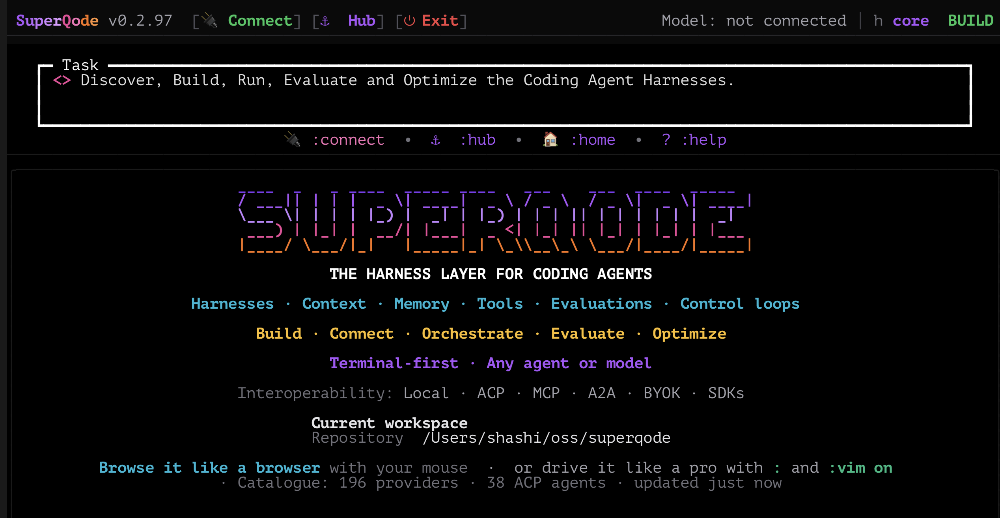

<p align="center">
  
</p>

<p align="center">
  <strong>The harness layer for coding agents.</strong><br>
  Discover, build, run, evaluate, and optimize coding-agent harnesses from one terminal.
</p>

<p align="center">
  <a href="https://pypi.org/project/superqode/"></a>
  <a href="https://pypi.org/project/superqode/"></a>
  <a href="LICENSE"></a>
  <a href="https://github.com/SuperagenticAI/superqode/stargazers"></a>
  <a href="https://github.com/SuperagenticAI/superqode/discussions"></a>
</p>

<p align="center">
  <a href="https://superagenticai.github.io/superqode/"><strong>Documentation</strong></a>
  &nbsp;·&nbsp;
  <a href="https://superagenticai.github.io/superqode/getting-started/quickstart/">Quick Start</a>
  &nbsp;·&nbsp;
  <a href="https://superagenticai.github.io/superqode/harness-hub/">Harness Hub</a>
  &nbsp;·&nbsp;
  <a href="https://super-agentic.ai/superqode/">Website</a>
  &nbsp;·&nbsp;
  <a href="https://github.com/SuperagenticAI/superqode/discussions">Discussions</a>
</p>

<p align="center">
  
</p>

## What is SuperQode?

Picking a capable model does not give you a reliable code production system. The
**harness** decides what the agent sees, which tools it may use, how it
remembers, what it is allowed to change, and how its work gets verified. That
layer is usually owned by a vendor, invisible, and impossible to measure.

SuperQode makes the harness a repository-owned artifact you can read, version,
test, and improve. One portable `HarnessSpec` controls the runtime, model
policy, tools, memory, search, sandbox, approvals, workflow, and evidence.

Connect the coding agents you already pay for, run local or hosted models, or
build your own harness. All of them run through the same inspectable contract.

## Quick Start

```bash
curl -fsSL https://superqode.dev/install.sh | sh
```

The installer pulls the latest release from PyPI into an isolated environment,
installs [uv](https://docs.astral.sh/uv/) when needed, and never uses `sudo`.
Already have uv? Run `uv tool install superqode` instead.

Open any repository and start:

```bash
cd your-project
superqode
```

Connect something, then work normally:

```text
:connect                # local models, ACP agents, BYOK, or a vendor plan
:connect codex          # or claude, copilot, grok, kimi-code, qwen-code, fx
```

```text
Summarize this repository and identify the smallest safe improvement.
```

Prefer a single headless task?

```bash
superqode --print "fix the failing test and summarize the change"
```

`sq` is a shorter alias for every `superqode` command. Remove it any time with
`uv tool uninstall superqode`.

## The Harness Hub

`:hub` opens a browsable catalog of **97 harnesses**: SuperQode's native
harnesses, vendor coding agents, the full ACP registry, optional runtimes,
model presets, and the HarnessSpecs your own repository defines.

```text
:hub                    # browse, search, and filter every route
:harness switch codex   # change harness mid-session, keeping the conversation
:harness switch rlm --fork   # or branch into an independent attempt
```

**55 of those harnesses are open source**, across every route. Press `o` in the
Hub, or ask from the command line:

```bash
sq hub list --openness open
sq hub show deepagents
sq hub list --json          # the same catalog, for scripts and dashboards
```

Openness describes the harness implementation, never SuperQode's route to it.
A license SuperQode cannot verify is reported as unknown rather than guessed.

## Bring Your Own Agent, or Build One

Connect an agent that already exists:

| Route | Examples |
| --- | --- |
| Vendor plans | Codex, Claude, GitHub Copilot, Grok, Devin, Factory Droid, Kiro |
| ACP agents | OpenCode, Goose, Cline, OpenHands, Deep Agents Code, and the full registry |
| Optional runtimes | LangChain DeepAgents, Hugging Face Tau, DeepSeek Harness, PydanticAI, Google ADK, OpenAI Agents SDK |
| Local models | Ollama, LM Studio, MLX, DS4, llama.cpp, vLLM, SGLang, TGI |

Or write your own. Start from the wizard, a template, or plain YAML:

```bash
superqode harness wizard
superqode harness init my-coder --template coding --output harness.yaml
superqode harness doctor --spec harness.yaml
superqode harness run --spec harness.yaml --prompt "review this repository"
```

Runnable examples live in [`examples/harnesses`](examples/harnesses). An
independently installed Python harness needs one async function and one entry
point to join the catalog:

```toml
[project.entry-points."superqode.harnesses"]
my-harness = "my_package:run"
```

### Native RLM

`rlm` is the built-in recursive harness. The model gets one executable tool and
a persistent Python environment, and builds context by writing Python instead of
calling separate search, edit, and shell tools:

```python
chunks = context.select("src/**/*.py").chunk(size=8000)
answers = llm_query_batched([chunk.labelled() for chunk in chunks])

children = rlm.run_batch(["Inspect the implementation", "Inspect the tests"])
results = rlm.wait_all(children)
```

It runs on the host, in a container with `sandbox: docker`, or inside a
no-filesystem interpreter with `sandbox: monty`.
See [Native RLM](https://superagenticai.github.io/superqode/advanced/rlm/).

## Evaluate and Optimize

Treat the harness the way you treat the rest of your code: measure it, then gate
changes against repeatable tasks.

```bash
superqode harness test --spec harness.yaml
superqode harness eval --spec harness.yaml --tasks eval-tasks.yaml
superqode harness eval --spec harness.yaml --variant candidate.yaml --tasks eval-tasks.yaml
```

Evaluation records behavior and never edits the spec. Optimization is a separate
outer loop, worth reaching for only once the tasks and scoring represent the
behavior that matters:

```bash
superqode harness optimize-omni --spec harness.yaml --tasks eval-tasks.yaml --max-evals 20
superqode harness promote stage
```

Candidates stay reviewable artifacts. GEPA Omni stages its selected HarnessSpec
separately, audits the mutation surfaces it is allowed to touch, and runs a
sealed held-out gate without replacing the live specification.

See the [evaluation and optimization guide](docs/advanced/harness-optimization.md)
and [Harness Promotion](docs/advanced/harness-promotion.md).

## Local and Open Models

SuperQode is tuned for the cases where context, tool calling, and search decide
whether an agent works at all:

- **Auto context management** detects the loaded context window and compacts
  before overflow.
- **Context economy** uses bounded reads, line-numbered output, continue hints,
  spill files, and stale-output pruning.
- **Local search** registers repositories with `:workspace add`, searches with
  ripgrep, and adds semantic indexes when needed.
- **Airplane Mode** prepares a strict offline harness with network tools removed.
- **Post-edit verification** feeds fast per-file checks back to the agent so it
  can correct itself before moving on.
- **Resilient tool calls** repair malformed calls and block no-progress loops.

```bash
superqode local init --repo .     # detect hardware, generate a starter harness
superqode providers scan-free     # find current zero-price model routes
```

Local inference uses real CPU, GPU, memory, and battery. Prefer smaller models
or hosted providers when a machine is constrained.

## Code Factory Workflows

For work that has to finish across several harnesses, use a durable WorkOrder
with bounded workers, isolated worktrees, crash recovery, acceptance checks, and
an explicit human delivery decision:

```bash
sq work create "Implement and review the authentication fix" \
  --repo . --harness coding \
  --acceptance-test "uv run pytest -q tests/test_auth.py" --queue
sq work worker --id builder-01 --concurrency 2
sq work approve work_... --actor maintainer
sq work merge work_... --actor maintainer --cleanup
```

Read the [Code Factory guide](https://superagenticai.github.io/superqode/advanced/software-factory/).

## Serve a Harness Over A2A

Everything above describes SuperQode as something you run. It also runs as an
[Agent2Agent](https://a2a-protocol.org/) agent that other systems call, which is
how a harness reaches an orchestrator, a multiplayer agent computer, or a host
platform such as Gemini Enterprise or Microsoft Foundry.

```bash
superqode serve a2a --spec harness.yaml
```

Discovery is a published Agent Card. One card advertises JSON-RPC and HTTP+JSON
across A2A 1.0 and 0.3, so a single document satisfies every registration path.

A remote bind is deliberate about what it exposes. It serves the
`harness-shortlist` skill, which answers questions about which coding agents and
harnesses to consider from the curated Harness Hub without touching a
repository. Running harnesses remotely requires opting in with `--expose-harness`
and naming the spec, because the spec decides what an accepted request may do.

Callers are identified by signed API keys that carry a customer, tier and
expiry, and are verified without a database:

```bash
superqode a2a-keys issue "Acme Corp" --tier one-off --days 30
```

Read the [A2A guide](docs/providers/a2a.md).

## Harness Execution Model

```text
1. SPEC       Choose coding, no-tool, local-model, or custom behavior
2. MODEL      Resolve local or hosted model policy
3. RUNTIME    Run on builtin, an SDK, ACP, or another backend
4. TOOLS      Attach file, search, edit, shell, MCP, or no tools
5. SESSION    Stream events, persist history, and compact context
6. OUTPUT     Return text, typed data, workflow results, and validation
```

Sessions are durable and the harness is replaceable. Switching keeps the session
ID and replays stored context through the newly selected harness.

SuperQode also normalizes each runtime's own stream into one event graph, so a
run is inspectable the same way regardless of the framework underneath:

| Backend | Rich graph events |
| --- | --- |
| `builtin` | Model requests, deltas, tool calls, results, approvals, final output |
| `deepagents` | Model deltas, tools, subagents, memory, sandbox events, final output |
| `codex-sdk` | Model deltas, command output, patches, file changes, completion |
| `openai-agents` | Model deltas, tool calls, results, approvals, sandbox markers |
| `pydanticai` | Model deltas, tool calls, results, approval pauses, final output |
| `adk` | Run and stream events using the shared graph storage contract |

```bash
superqode harness events <run-id>
superqode harness graph <run-id> --json
```

## Documentation

| Guide | What it covers |
| --- | --- |
| [Quick Start](https://superagenticai.github.io/superqode/getting-started/quickstart/) | Install, connect, and run your first task |
| [Harness Hub](https://superagenticai.github.io/superqode/harness-hub/) | Browsing, filtering, and the published catalog |
| [Connection Methods](docs/concepts/modes.md) | Local, ACP, BYOK, SDK, MCP, and A2A routes |
| [A2A Agents](docs/providers/a2a.md) | Serving a harness over A2A, skills, API keys, and the Agent Card |
| [Developer Workflows](docs/developer-workflows.md) | The complete TUI and CLI command set |
| [Harness System](docs/advanced/harness-system.md) | HarnessSpec fields, runtimes, and policy |
| [Harness Protocol](docs/advanced/harness-protocol.md) | The versioned session and evidence contract |
| [Bring Your Own Harness](docs/getting-started/bring-your-own-harness.md) | Templates, wizard, and repository specs |

## Contributing

Contributions are welcome. See [CONTRIBUTING.md](CONTRIBUTING.md).

```bash
git clone https://github.com/SuperagenticAI/superqode
cd superqode
uv sync --extra dev --extra docs
uv run pytest
```

## License

[Apache-2.0](LICENSE), built by [Superagentic AI](https://super-agentic.ai/).
