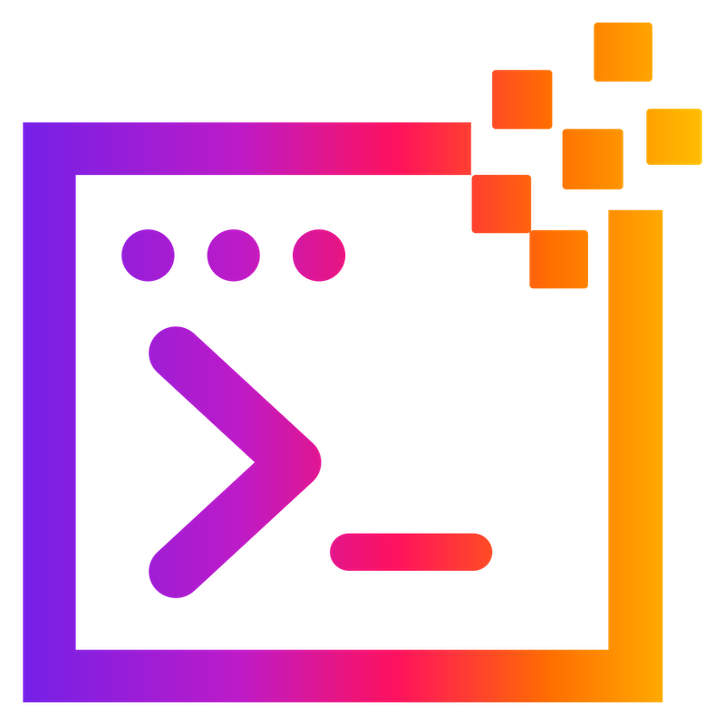

<p align="center">
  
</p>

<h1 align="center">SuperQode</h1>

<p align="center">
  
</p>

<h3 align="center">The harness layer for coding agents.</h3>

<p align="center">
  Build your own harnesses or connect the agents you already use: open-source,
  proprietary, local, or hosted.
</p>

<p align="center">Terminal-first · Any agent · Any model · Local or cloud · Open source</p>

<p align="center">
  <a href="https://pypi.org/project/superqode/"></a>
  <a href="https://pypi.org/project/superqode/"></a>
  <a href="https://github.com/SuperagenticAI/superqode/blob/main/LICENSE"></a>
  <a href="https://github.com/SuperagenticAI/superqode/stargazers"></a>
  <a href="https://github.com/SuperagenticAI/superqode/network/members"></a>
  <a href="https://github.com/SuperagenticAI/superqode/issues"></a>
  <a href="https://github.com/SuperagenticAI/superqode/pulls"></a>
  <a href="https://super-agentic.ai/superqode/"></a>
</p>

<h3 align="center">
  <a href="https://superagenticai.github.io/superqode/">📚 Read the Full Documentation →</a>
</h3>

<p align="center">
  <a href="https://super-agentic.ai/superqode/"><strong>Website</strong></a>
  &nbsp;·&nbsp;
  <a href="https://superagenticai.github.io/superqode/getting-started/quickstart/"><strong>Quick Start</strong></a>
  &nbsp;·&nbsp;
  <a href="https://github.com/SuperagenticAI/superqode/discussions">Discussions</a>
</p>

## What is SuperQode?

SuperQode is the open-source, terminal-first harness layer for coding agents.
Build your own harnesses, run SuperQode's native harnesses, or connect the
coding agents you already use.

Run local or hosted models and the coding agents you already use through one
inspectable, portable HarnessSpec while keeping tools, policies, sessions, and
evidence under your control.

## Install

```bash
curl -fsSL https://super-agentic.ai/superqode.sh | sh
```

The installer gets the latest SuperQode release from PyPI in an isolated
environment, installs `uv` when needed, and does not use `sudo`.

Already use [uv](https://docs.astral.sh/uv/)?

```bash
uv tool install superqode
```

Then open any project:

```bash
cd your-project
superqode
```

`sq` is included as a shorter alias for every `superqode` command.

Uninstall anytime:

```bash
uv tool uninstall superqode
```

## Get Started

SuperQode first works like a normal terminal coding agent. Open a repository,
connect the coding agent or model you already use, and give it a task:

```text
:connect                # local, ACP, BYOK, subscriptions, or other harnesses
:connect subscriptions  # Codex, Claude, Grok, Copilot, Gemini CLI, Devin, ...
:connect codex
:connect copilot
:connect kimi-code
:connect qwen-code
:connect acp opencode
```

Then work normally:

```text
Summarize this repository and identify the smallest safe improvement.
```

Open the unified Harness Switcher when you want to change the complete agent
behavior without leaving SuperQode:

```text
:harness
:harness switch
:harness switch qwen-code --fork
```

The picker includes SuperQode native harnesses, project HarnessSpecs, vendor
and ACP coding agents, optional integrations such as Hugging Face Tau and
DeepSeek Harness, installed and registry harnesses, and model presets.

For a safe local-first setup:

```text
:local init       # detect hardware and create a starter harness
:connect local    # choose Ollama, LM Studio, MLX, DS4, llama.cpp, vLLM, or SGLang
:harness          # select the generated or another active harness
```

Or run a single headless task:

```bash
superqode --print "inspect this repository and suggest the smallest next step"
```

SuperQode starts with the compact `core` harness and its `read`, `write`, `edit`,
and `bash` tools. Select `workbench` when you want the broader native toolset:

```bash
superqode harness list
superqode --harness workbench --print "review this repository"
superqode harness use workbench
```

### Native RLM

`rlm` is the built-in recursive harness. The model gets exactly one executable
tool, a persistent Python environment, and builds context by writing Python
rather than by calling separate search, edit and shell tools:

```bash
superqode --harness rlm
```

```python
chunks = context.select("src/**/*.py").chunk(size=8000)
answers = llm_query_batched([chunk.labelled() for chunk in chunks])

children = rlm.run_batch(["Inspect the implementation", "Inspect the tests"])
results = rlm.wait_all(children)
```

It runs on the host by default, or inside a container with `sandbox: docker`, or
inside a no-filesystem interpreter with `sandbox: monty` for research and
evaluation. See [Native RLM](https://superagenticai.github.io/superqode/advanced/rlm/).

## Progressive Learning Path

Use SuperQode in stages. Each stage builds on a working developer experience
from the previous stage.

| Stage | Goal | Start with |
| --- | --- | --- |
| 1. Use | Work in a repository with a normal terminal coding-agent workflow | [`superqode`](#get-started) |
| 2. Connect | Select a coding agent, hosted provider, local model, or optional harness | [`:connect`](docs/concepts/modes.md) |
| 3. Switch | Change harnesses during a session while preserving or forking context | [Choose a Harness](#choose-a-harness) |
| 4. Build | Create a repository-owned HarnessSpec when you need repeatable behavior | [Create Your Own Harness](#create-your-own-harness) |
| 5. Evaluate | Measure the harness with tasks, scorecards, and regression gates | [Evaluate and Optimize](#evaluate-and-optimize) |
| 6. Optimize | Generate staged candidates after the evaluation contract is meaningful | [Evaluate and Optimize](#evaluate-and-optimize) |
| 7. Operate | Coordinate durable, verified work across harnesses and repositories | [Code Factory Workflows](#code-factory-workflows) |

## Developer Workflows

Use SuperQode as a daily coding-agent harness from the TUI or CLI:

```bash
superqode
superqode --print "fix the failing test and summarize the change"
superqode --runtime codex-sdk --print "review this repository"
superqode --runtime claude-agent-sdk --print "summarize the last change"
```

Inside the TUI, start with `:help`. Common commands include:

```text
:tour                   # progress from first connection to measured harness
:explore                # inspect capabilities available on this machine
:connect local          # local model provider
:connect acp            # installed and featured ACP coding agents
:connect byok           # hosted provider or API-key path
:connect subscriptions  # vendor coding agents on a plan you already pay for
:connect codex          # Codex SDK with local Codex login
:connect copilot        # GitHub Copilot plan (SDK preferred, CLI fallback)
:runtime claude-agent-sdk # Anthropic API-key runtime
:connect antigravity    # signed-in Antigravity CLI
:connect acp refresh    # refresh the cached official ACP Registry
:mcp                    # tool and resource server connections
:a2a                    # remote A2A agent connections
:tree                   # saved session branches
:share create           # portable session artifact
:export markdown        # transcript export
:trust doctor           # project plugin, MCP, and hook audit
:plugins doctor         # plugin manifest validation
:plan fix the tests     # planning-only review
:plan approve           # execute the approved plan
:eval                   # explain or run repository harness evaluation
:memory providers       # memory provider status
:memory remember ...    # explicit project memory
:vim on                 # optional Vim-like navigation
```

CLI equivalents:

```bash
superqode sessions tree
superqode share create <session-id>
superqode share import <artifact.superqode-share.json> --session-id imported
superqode trust doctor
superqode trust yes
superqode plugins add ./my-plugin
superqode plugins doctor
superqode memory remember "Use pnpm in this repo" --kind preference
superqode memory search "package manager"
superqode memory providers
```

Find local inference paths and current zero-price model routes:

```bash
superqode providers scan-free
superqode providers scan-free --live --source openrouter --limit 20
```

See [Developer Workflows](docs/developer-workflows.md) for the complete command
set and [Connection Methods and Vendors](docs/concepts/modes.md) for the
supported local, ACP, BYOK, SDK, MCP, and A2A paths.

## Choose a Harness

Open `:harness` in the TUI to select a built-in harness, a project
`HarnessSpec`, or an installed adapter. The same choices are available from the
CLI:

```bash
superqode harness list
superqode harness show core
superqode harness wizard
superqode harness doctor --spec harness.yaml
superqode harness run --spec harness.yaml --prompt "summarize the architecture"
```

Sessions remain durable when you switch harnesses. You can continue the same
conversation or fork it for an independent attempt:

```text
:harness switch workbench
:harness switch kimi-coding --fork
:sessions switch
```

Other optional runtimes include OpenAI Agents SDK, Google ADK, Codex SDK,
GitHub Copilot SDK, Claude Agent SDK, DeepAgents, PydanticAI, and RLM Code. See
[runtime setup](https://superagenticai.github.io/superqode/getting-started/installation/#optional-dependencies)
for installation commands and authentication guidance.

### Harness Sessions

The conversation session is durable and the active harness is replaceable.
Switching harnesses keeps the same session ID and replays the stored context
through the selected harness. Use `--fork` when the new harness should work on
an independent copy of the conversation.

```bash
superqode --print --resume SESSION_ID --harness workbench "continue the task"
superqode --print --fork SESSION_ID --harness kimi-coding "try another approach"
```

The harness catalog reports runtime mode, readiness, continuity, and model
route. The session picker restores the latest harness, model, and conversation
history for each saved session. Vendor-owned thread stores remain available
through runtime commands such as `:codex sessions` and `:claude sessions`.

### Common Harness Choices

| Goal | Start with |
| --- | --- |
| Let SuperQode edit, search, and run shell commands under policy | `superqode harness init app --template coding` |
| Evaluate model capability without repository access | `superqode harness init reasoner --template no-tool` |
| Start from an Open Model family pack | `superqode harness list-templates` |
| Generate a local-first harness for this machine | `superqode local init --repo .` |

## What SuperQode Does

SuperQode makes the coding-agent harness an inspectable, repository-owned
engineering artifact. A portable `HarnessSpec` controls the runtime, model,
tools, memory, search, sandbox, approvals, workflow, checks, and event history.

That lets you:

- **Build** versioned harnesses with templates, a wizard, or plain YAML.
- **Connect** existing agents through native runtimes, ACP, MCP, and A2A.
- **Run** local or hosted models without changing the harness contract.
- **Observe** reasoning, tool activity, usage, progress, and durable sessions.
- **Evaluate** agent behavior with scorecards, benchmarks, and regression gates.
- **Govern** file, shell, network, credential, budget, and approval policies.
- **Optimize** model routes and harness candidates using recorded evidence.

## Why Own the Harness?

Selecting a capable model does not give an organization a reliable code
production system. The harness still decides what the agent sees, which tools
it can use, how it remembers, what it may change, and how its work is verified.

Teams commonly face several related problems:

- Established coding agents provide useful but vendor-owned harnesses that
  cannot always be inspected, moved, or evaluated independently.
- Open and local models provide model capability without a complete repository
  coding harness.
- Different agents keep separate sessions, context, tools, permissions, and
  evidence.
- Session orchestration alone does not ensure repository work finishes, passes
  checks, or produces an exact candidate a human can approve.
- Harness changes are difficult to compare when quality, cost, latency,
  regressions, and failed candidates are not recorded together.

SuperQode makes the harness a repository-owned engineering artifact, connects
existing agents through native runtimes and ACP, and applies a consistent
lifecycle for execution, evaluation, governance, evidence, delivery, and
optimization.

## Core Concepts

SuperQode separates agent systems into interchangeable pieces:

- The **harness** controls runtime, tools, sandbox, memory, search, workflow,
  approvals, and model policy.
- The **runtime** executes the work.
- **Tools** expose file, search, edit, shell, MCP, and verification capabilities
  under policy.
- **Model policy** controls routing, temperature, reasoning, context, and
  iteration limits.

You can change any one of these pieces without rewriting the rest.

## Create Your Own Harness

Use the interactive wizard:

```bash
superqode harness wizard
superqode harness explain --spec harness.yaml
superqode harness doctor --spec harness.yaml
superqode harness run --spec harness.yaml --prompt "review this repository"
```

Or start from a template:

```bash
superqode harness init my-coder --template coding --output harness.yaml
```

Ready-to-run examples are in [`examples/harnesses`](examples/harnesses).
Independent Python harnesses can integrate through one async entry point and
the versioned [Harness Protocol](docs/advanced/harness-protocol.md).

After a run, inspect what happened:

```bash
superqode harness events <run-id>
superqode harness graph <run-id>
superqode harness graph <run-id> --json
```

Harness Protocol v1 provides one versioned session and evidence contract for
native Core, direct Python harnesses, and ACP agents. Inspect the protocol or
run the deterministic offline conformance suite:

```bash
superqode harness protocol describe
superqode harness protocol conformance
```

An independently installed Python harness needs one async function and one
entry point:

```toml
[project.entry-points."superqode.harnesses"]
my-harness = "my_package:run"
```

```bash
superqode harness list
superqode harness run my-harness "review this diff"
superqode harness protocol conformance my-harness
```

Use `doctor` before sharing a harness with a team. It checks backend
availability, spec compatibility, sandbox policy, event-store readiness,
approval support, MCP paths, and rich event graph support.

## Evaluate and Optimize

For developer teams, this is the practical **CI for coding-agent harnesses**:
validate the repository-owned contract, diagnose its environment, and gate
behavior changes against repeatable tasks. It complements SuperQode's broader
agent-engineering position; it is not a separate product mode.

Run and measure the harness before attempting optimization:

```bash
superqode harness test --spec harness.yaml
superqode harness eval --spec harness.yaml --tasks eval-tasks.yaml
superqode harness auto-bench --spec harness.yaml --tasks eval-tasks.yaml
```

Evaluation records the current behavior. It does not modify the HarnessSpec.
Compare a candidate against the baseline before adoption:

```bash
superqode harness eval \
  --spec harness.yaml \
  --variant candidate.yaml \
  --tasks eval-tasks.yaml
```

Optimization is an optional outer loop. Use it only after the tasks and scoring
contract represent the behavior that matters:

```bash
superqode harness optimize \
  --spec harness.yaml \
  --tasks eval-tasks.yaml \
  --export-only

superqode harness optimize-omni \
  --spec harness.yaml \
  --tasks eval-tasks.yaml \
  --max-evals 20 \
  --live
```

Candidates remain reviewable artifacts. GEPA Omni stages its selected
HarnessSpec separately, audits allowed mutation surfaces, and runs a sealed
held-out gate without replacing the live specification.

Use the
[harness evaluation and optimization guide](docs/advanced/harness-optimization.md)
for task design, scorecards, MetaHarness, GEPA Omni, budgets, and result
inspection. Use [Harness Promotion](docs/advanced/harness-promotion.md) to
stage, canary, activate, or roll back an accepted harness.

## Local and Open Model Support

SuperQode is tuned for local and Open Models, where context, tool calling,
memory, and search often determine whether an agent works:

- **Auto context management:** Detect the loaded context window and compact
  before overflow. Inspect or pin it with `:context`.
- **Context economy tools:** Use bounded reads, line-numbered output, continue
  hints, spill files, stale-output pruning, and compact previews.
- **Local search stack:** Register repositories with `:workspace add`, search
  across them with ripgrep, and enable semantic search when needed.
- **Airplane Mode:** Prepare a strict offline harness with local repositories,
  local models, cached metadata, and network tools removed.
- **Post-edit verification:** Feed fast per-file checks back to the agent so it
  can correct mistakes before moving on.
- **Resilient tool calls:** Repair malformed tool calls, return corrective
  feedback, and block repeated no-progress loops.
- **Model-aware edits:** Support string replacement, unified diffs, patch
  envelopes, shell sessions, and vision attachments where available.
- **Safe parallelism:** Run read-only tool batches concurrently while
  preserving strict order for edits, writes, and shell commands.

Local inference can use substantial CPU, GPU, memory, battery, and disk
bandwidth. Monitor your hardware and use smaller models, lower context, or
hosted providers when a machine is constrained.

### Project and Harness Configuration

`superqode.yaml` and `superqode.local.yaml` have different jobs:

| File | Purpose | Created by |
| --- | --- | --- |
| `superqode.yaml` | Project providers, endpoints, MCP, memory, aliases, and defaults | `superqode config init` or `:init` |
| `harness.yaml` | Portable agent run contract | `:harness wizard` or `superqode harness init` |
| `superqode.local.yaml` | Local-first HarnessSpec generated for this machine | `:local init` or `superqode local init --repo .` |
| `superqode.airplane.yaml` | Strict no-network HarnessSpec for offline work | `:local airplane prepare` |

## Code Factory Workflows

For work that must finish across multiple harnesses, use a durable WorkOrder:

```bash
sq work create "Implement and review the authentication fix" \
  --repo . \
  --harness coding \
  --acceptance-test "uv run pytest -q tests/test_auth.py" \
  --queue
sq work worker --id builder-01 --concurrency 2
sq work watch work_...
sq work check work_...
sq work prepare work_...
sq work approve work_... --actor maintainer
sq work merge work_... --actor maintainer --cleanup
```

WorkOrders provide bounded workers, isolated worktrees, crash recovery,
acceptance checks, typed evidence, and an explicit human delivery decision.
Read the [Code Factory guide](https://superagenticai.github.io/superqode/advanced/software-factory/)
for the complete workflow.

## Key Capabilities

- **Harness specification:** One portable spec controls runtime, model policy,
  tools, memory, search, sandbox, approvals, workflow, and output.
- **Harness independence:** Inspect, version, measure, and improve the agent
  loop as a repository artifact.
- **Harness Protocol v1:** Run native Core, Python harnesses, and ACP agents
  through one versioned lifecycle and durable evidence envelope.
- **Extensible minimal Core:** Start with `read`, `write`, `edit`, and `bash`,
  then add trusted packages or project plugins.
- **Model routing:** Use Open Models or closed models, local endpoints or hosted
  providers, and role-specific routes.
- **Local-first support:** Detect engines, probe context windows, generate
  starter harnesses, run smoke checks, and benchmark candidates.
- **Dynamic RLM workflows:** Analyze large logs, traces, diffs, and repository
  slices with bounded recursive workflows, using the built-in `rlm` harness for
  coding work and RLM Code for paper reproduction and benchmarks.
- **Measure and optimize:** Use harness tests, scorecards, route optimization,
  skill optimization, and regression gates.
- **Local code intelligence:** Use bounded reads, multi-repository search,
  semantic indexes, and post-edit verification.
- **Configurable memory:** Keep memory local by default and connect
  provider-neutral memory systems when needed.
- **Pluggable runtimes:** Use the builtin engine, ADK, OpenAI Agents SDK, Codex
  SDK, GitHub Copilot SDK, Claude Agent SDK, DeepAgents, PydanticAI, or RLM
  Code while preserving the common contract each runtime supports.
- **Policy and safety:** Gate files, shell commands, network access, approvals,
  credentials, sandboxing, plugins, MCP, and project trust.
- **Headless and CI ready:** Run tasks, provider checks, evaluations,
  schema-validated outputs, event exports, and change summaries from scripts.

### Harnesses over MCP

Expose every HarnessSpec in a directory as an MCP tool:

```bash
superqode mcp --dir ./harnesses
superqode mcp --dir ./harnesses --http --port 8765
```

This is separate from adding external MCP tools to a harness through
`runtime.config.mcp_servers`. See the
[MCP command](docs/cli-reference/mcp-command.md) and
[MCP configuration](docs/configuration/mcp-config.md) guides.

## Harness Execution Model

```text
HARNESS LIFECYCLE
1. SPEC       Choose coding, no-tool, local-model, or custom behavior
2. MODEL      Resolve local or hosted model policy
3. RUNTIME    Run on builtin, SDK, ACP, or another backend
4. TOOLS      Attach file, search, edit, shell, MCP, or no tools
5. SESSION    Stream events, persist history, and compact context
6. OUTPUT     Return text, typed data, workflow results, and validation
```

The default coding harness supports repository operations. The no-tool harness
evaluates model capability without repository or tool access. Optional runtimes
let teams use existing agent frameworks without replacing the SuperQode
harness contract.

## Runtime Observability

SuperQode normalizes runtime-specific streams into one harness event graph:

| Backend | Rich graph events |
| --- | --- |
| `builtin` | Model requests, deltas, tool calls, results, approvals, final output |
| `pydanticai` | Model deltas, tool calls, results, approval pauses, final output |
| `openai-agents` | Model deltas, tool calls, results, approvals, sandbox markers |
| `codex-sdk` | Model deltas, command output, patches, file changes, completion |
| `deepagents` | Model deltas, tools, subagents, memory, sandbox events, final output |
| `adk` | Run and stream events using the shared graph storage contract |

This gives teams one way to inspect and debug runs across different agent
frameworks.

## Contributing

Contributions are welcome. See [CONTRIBUTING.md](CONTRIBUTING.md).

```bash
git clone https://github.com/SuperagenticAI/superqode
cd superqode
uv sync --extra dev --extra docs
uv run pytest
```

## License

[Apache-2.0](LICENSE) - built by
[Superagentic AI](https://super-agentic.ai/).

---

<p align="center">
  <strong>Build a coding-agent harness you can inspect, govern, and improve.</strong><br>
  <a href="https://super-agentic.ai/superqode/"><strong>🌐 SuperQode Website →</strong></a>
  &nbsp;·&nbsp;
  <a href="https://superagenticai.github.io/superqode/"><strong>📚 Explore the Full Documentation →</strong></a>
  &nbsp;·&nbsp;
  <a href="https://superagenticai.github.io/superqode/getting-started/quickstart/"><strong>Get Started</strong></a>
</p>
