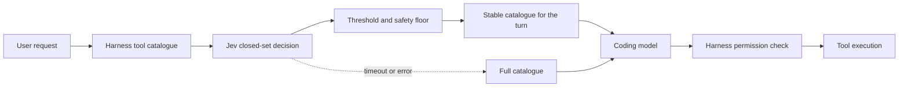

# Jev Tool Routing

Jev Tool Routing reduces the tool-schema context sent to coding models. It asks
[TypeSafe AI's Jev](https://typesafe.ai/blog/introducing-system-one-models-and-jev)
which tools a request is likely to need, applies SuperQode's safety rules, and
keeps one stable selection for the complete turn.

The coding model still writes every command, path, patch, and tool argument.
The harness still owns permissions and execution. Jev only selects tool
definitions from a closed catalogue.

!!! success "Measured on 21 September 2026"
    The five-scenario evaluation produced **64% average catalogue reduction**,
    **100% required-tool recall**, and **667ms average local Jev latency**. The
    hosted service selected the same tools with **556ms average server-reported
    latency**. End-to-end runs measured **25 → 7 tools for Grok Build**,
    **28 → 2 for Claude Code**, and **10 → 6 for OpenCode**. Every included
    coding task passed.

[Start locally](#quick-start){ .md-button .md-button--primary }
[Benchmark results](#benchmark-results){ .md-button }
[Reproduce the benchmarks](../cli-reference/optimize-commands.md#reproduce-the-benchmarks){ .md-button }

## What problem it solves

Coding harnesses commonly send every available tool definition on every model
call. Names, descriptions, JSON schemas, enums, examples, and provider metadata
can consume thousands of input tokens even when a turn needs only repository
reads and a test command.

Jev is a structured decision model rather than a chat model. SuperQode presents
the task and bounded tool choices to Jev once, then applies a threshold,
protected-tool floor, and dependency rules. The catalogue remains unchanged
across later steps in the turn, preserving a stable prefix for provider caching.



Jev never receives authority to execute a tool. A timeout, transport error,
incomplete answer, or empty selection returns the complete catalogue.

## Quick start

Install SuperQode and provide a TypeSafe key:

```bash
uv tool install superqode==2.4.10
export TYPESAFE_API_KEY="..."
```

Inspect the machine, test Jev connectivity, and verify an adapter without
calling its coding model:

```bash
superqode optimize doctor
superqode optimize setup
superqode optimize verify opencode
```

Run OpenCode in the default `shadow` mode:

```bash
export GEMINI_API_KEY="..."
superqode optimize run opencode \
  --provider google \
  --model gemini-3.8-flash -- \
  run "review this repository"
```

The command starts a loopback gateway, injects a process-scoped endpoint
override, launches the original harness, prints aggregate routing metrics, and
removes temporary state. It does not rewrite persistent harness configuration.

After reviewing the shadow result, apply the selection:

```bash
superqode optimize run opencode \
  --provider google \
  --model gemini-3.8-flash \
  --mode enforce -- \
  run "review this repository"
```

## Shadow and enforce modes

| Mode | Jev decision | Catalogue sent to coding model | Recommended use |
| --- | --- | --- | --- |
| `off` | Skipped | Full catalogue | Disable native routing |
| `shadow` | Recorded | Full catalogue | First evaluation and comparison |
| `enforce` | Recorded and applied | Selected catalogue plus protected tools | After workflow validation |

The default keep threshold is `0.30`. A higher value removes more candidates
and needs stronger evaluation. A lower value is more conservative. Protected
workspace tools and dependency rules take precedence over the threshold.

## Supported harnesses

| Harness | Integration | Catalogue status | Important boundary |
| --- | --- | --- | --- |
| SuperQode | Native in-process router | Routable | Controlled by routing environment variables |
| OpenCode | Temporary provider overlay | Routable | OpenAI, Anthropic, and native Gemini routes |
| Claude Code | `ANTHROPIC_BASE_URL` process override | Routable | Anthropic Messages protocol |
| Grok Build | `GROK_MODELS_BASE_URL` process override | Routable | Custom endpoints use xAI API-key authentication |
| Pi | Isolated temporary provider directory | Routable | Stock Pi has four core tools |
| Codex | One-run provider override | Gateway-limited | Subscription traffic injects tools server-side |
| Antigravity | Detection only | Detect-only | Its CLI exposes no model-endpoint hook |

`gateway-limited` means model traffic is visible while tool definitions are
absent from the client request. `detect-only` means SuperQode can identify the
installation but cannot safely intercept model traffic. Neither state is
presented as a saving.

## Harness recipes

Pass harness-native arguments after `--`.

=== "OpenCode"

    ```bash
    export TYPESAFE_API_KEY="..."
    export GEMINI_API_KEY="..."
    superqode optimize run opencode \
      --provider google --model gemini-3.8-flash -- \
      run "fix the failing tests"
    ```

=== "Claude Code"

    ```bash
    export TYPESAFE_API_KEY="..."
    export ANTHROPIC_API_KEY="..."
    superqode optimize run claude --provider anthropic -- \
      --print --no-session-persistence "review this repository"
    ```

=== "Grok Build"

    ```bash
    export TYPESAFE_API_KEY="..."
    export XAI_API_KEY="..."
    superqode optimize run grok --provider xai -- \
      --single "review this repository"
    ```

=== "Pi"

    ```bash
    export TYPESAFE_API_KEY="..."
    export GEMINI_API_KEY="..."
    superqode optimize run pi \
      --provider google --model gemini-3.8-flash -- \
      --print "review this repository"
    ```

=== "Native SuperQode"

    ```bash
    export TYPESAFE_API_KEY="..."
    export SUPERQODE_TOOL_ROUTING=shadow
    superqode
    ```

## Managed launchers

Create separate `*-jev` commands after validating the routes:

```bash
superqode optimize enable opencode claude grok pi
superqode optimize status
opencode-jev run "review this repository"
```

The original vendor commands remain unchanged. Preferences contain provider,
model, mode, threshold, and launcher location; credentials remain in the
environment. Remove selected or all managed launchers with:

```bash
superqode optimize disable opencode
superqode optimize uninstall
```

A launcher is removed only when it still carries SuperQode's management marker,
protecting a user-owned replacement at the same path.

## Environment variables

### Credentials

| Variable | Required for | Written to configuration |
| --- | --- | --- |
| `TYPESAFE_API_KEY` | Every live local Jev decision | No |
| `OPENAI_API_KEY` | OpenAI upstream traffic | No |
| `ANTHROPIC_API_KEY` | Anthropic and Claude Code upstream traffic | No |
| `GEMINI_API_KEY` | Native Gemini traffic from OpenCode or Pi | No |
| `XAI_API_KEY` | xAI traffic from Grok Build | No |
| `SUPERQODE_JEV_SERVICE_TOKEN` | Remote HTTP or Streamable HTTP MCP service | No |

Provider and harness processes inherit the launching shell environment.
Temporary OpenCode and Pi configuration uses a non-secret loopback placeholder;
provider credentials are never serialized into those generated files.

### Routing controls

| Variable | Values | Default | Purpose |
| --- | --- | --- | --- |
| `SUPERQODE_TOOL_ROUTING` | `off`, `shadow`, `enforce` | `off` | Native SuperQode routing mode |
| `SUPERQODE_TOOL_ROUTING_THRESHOLD` | `0.0`–`1.0` | `0.30` | Minimum keep probability |
| `SUPERQODE_TOOL_ROUTING_TIMEOUT_MS` | Positive integer | `1500` | Native decision deadline |
| `SUPERQODE_TOOL_ROUTING_ALWAYS_KEEP` | Comma- or space-separated names | Core tools | Additional protected tools |
| `SUPERQODE_BIN_DIR` | Directory | `~/.local/bin` | Managed launcher destination |
| `SUPERQODE_HOME` | Directory | `~/.superqode` | Preferences and state root |
| `PORT` | Integer | `8080` | HTTP service port |

Command options such as `--mode`, `--threshold`, `--model`, `--provider`, and
`--port` configure one managed run. Native-loop variables apply when SuperQode
owns the model loop. See the central
[environment-variable reference](../configuration/environment-variables.md#jev-tool-routing).

## Python SDK

Python harnesses can route in-process:

```python
from superqode.jev_tools import JevToolRouting

router = JevToolRouting(mode="enforce", threshold=0.30, timeout_ms=1500)
result = await router.route(
    "Review this repository and run its tests",
    tool_catalogue,
    turn_id="turn-123",
)
model_tools = list(result.tools)
```

Create one router per process and reuse `turn_id` across every model step in
one user turn. `RoutingResult` includes selected objects, counts, dropped names,
schema bytes, mode, status, latency, and cache status.

For a remote service:

```python
from superqode.jev_tools import JevToolRoutingClient

client = JevToolRoutingClient(
    "https://jev.superqode.dev",
    token="service-token",
)
result = await client.route(
    "Fix the failing parser test",
    tool_catalogue,
    turn_id="turn-123",
    mode="enforce",
    threshold=0.30,
)
```

## HTTP and MCP service

Start the reusable service locally:

```bash
export TYPESAFE_API_KEY="..."
superqode serve jev
```

| Surface | Endpoint |
| --- | --- |
| Health | `GET /healthz` |
| Routing API | `POST /v1/route-tools` |
| Streamable HTTP MCP | `/mcp` |
| Local stdio MCP | `superqode optimize mcp` |

The HTTP request contains `request`, `tools`, `turn_id`, `mode`, and
`threshold`. The response returns preserved selected objects, counts, dropped
names, status, latency, cache status, and schema-byte counts.

Non-loopback binds require `--allow-remote` and
`SUPERQODE_JEV_SERVICE_TOKEN`. Every endpoint except `/healthz` then requires
`Authorization: Bearer <token>`.

The public deployment is
[`jev.superqode.dev`](https://jev.superqode.dev). The complete Cloud Run
procedure is in
[`deploy/jev/README.md`](https://github.com/SuperagenticAI/superqode/blob/main/deploy/jev/README.md).

!!! info "MCP boundary"
    MCP can route a catalogue supplied by its caller. It cannot rewrite hidden
    built-in tools inside another harness. Native or gateway integration is
    required at that interception point.

## Safety and data handling

- Routing fails open: errors preserve the full catalogue.
- Core workspace tools can remain protected regardless of probability.
- One decision is cached in memory for a stable `turn_id`.
- The router returns definitions and never executes tools.
- The harness retains its permission and sandbox policy.
- The service stores no prompts, definitions, credentials, or decisions on disk.
- Aggregate gateway reports exclude prompts, arguments, bodies, and credentials.
- Cloud instances can restart, so callers must accept a safe repeated decision.

## Benchmark results

The snapshot used SuperQode 2.4.10 and threshold `0.30`. Grok Build, Claude
Code, and OpenCode ran the calculator task twice per mode in alternating order.
Every included run returned two passing tests and `add(19, 23) = 42`.

| Harness and model | Tools | Schema reduction | Input change | Reported cost, shadow → enforce | Wall time, shadow / enforce |
| --- | ---: | ---: | ---: | ---: | ---: |
| Grok Build 1.0.40, `grok-4.6` | 25 → 7 | 75.8% | 50.9% lower | $0.04261 → $0.02766 | 11.64s / 13.92s |
| Claude Code 2.1.275, Haiku 4.5 | 28 → 2 | 86.0% | 72.7% lower | $0.03582 → $0.01302 | 10.38s / 10.61s |
| OpenCode 1.17.11, `gemini-3.8-flash` | 10 → 6 | 41.1% | 2.3% lower | $0.02728 → $0.02709 | 9.08s / 10.11s |

OpenCode shows why schema reduction and end-to-end cost are separate measures:
one enforce repetition added a model step, leaving cost effectively flat. This
small sample establishes integration behavior; it is not a distribution.

The coding-model-free labelled evaluation produced:

| Scenario | Tools | Reduction | Required recall | Local latency |
| --- | ---: | ---: | ---: | ---: |
| Workspace test | 20 → 6 | 70% | 100% | 810ms |
| Web research | 20 → 9 | 55% | 100% | 620ms |
| Image task | 20 → 7 | 65% | 100% | 682ms |
| Database analysis | 20 → 7 | 65% | 100% | 567ms |
| Browser form | 20 → 7 | 65% | 100% | 655ms |
| **Average** | | **64%** | **100%** | **667ms** |

The Cloud Run service selected the same sets with 556ms average server-reported
latency. Pi remained 4 → 4. Codex completed the task, while zero client-visible
definitions made the route gateway-limited. Antigravity remained detect-only.

Read the [measurement definitions, caveats, and complete reproduction
procedure](../cli-reference/optimize-commands.md#benchmark-snapshot-21-september-2026).
The exact fixture is committed under
[`examples/bench/jev-tool-routing`](https://github.com/SuperagenticAI/superqode/tree/main/examples/bench/jev-tool-routing).

## Command map

| Command | Purpose |
| --- | --- |
| `optimize doctor` | Detect harnesses and integration status |
| `optimize setup [HARNESS]` | Check readiness and print launch commands |
| `optimize verify HARNESS` | Validate adapter, reduction, and cache reuse |
| `optimize run HARNESS` | Run through the managed loopback gateway |
| `optimize env HARNESS` | Preview command, environment, and generated files |
| `optimize bench` | Run the labelled evaluation without a coding model |
| `optimize enable [HARNESS]...` | Create managed `*-jev` launchers |
| `optimize status` | Inspect launcher configuration and health |
| `optimize disable [HARNESS]...` | Remove selected launchers |
| `optimize uninstall` | Remove every managed launcher and preference |
| `optimize mcp` | Start the local stdio routing MCP server |

See the [complete CLI reference](../cli-reference/optimize-commands.md) for
arguments, output fields, and benchmark commands.

## Troubleshooting

| Symptom | Meaning | Action |
| --- | --- | --- |
| `TYPESAFE_API_KEY is required` | Jev cannot be called | Export the key in the launching process |
| `jev-unavailable` | The control probe failed | Check the key, network, and TypeSafe service |
| `gateway-limited` | Tool definitions are absent | Treat the route as observation only |
| `detect-only` | No endpoint hook is exposed | A native or endpoint integration is required |
| `needs-model` for Pi | The temporary provider needs a model id | Pass `--model MODEL` |
| Pi reports `0%` | Its four stock tools are protected | Add extensions before expecting savings |
| Full catalogue after timeout | Fail-open activated | Measure latency before raising the deadline |
| Selection changes between steps | Turn identity changed | Reuse one `turn_id` for the full turn |
| Launcher is absent from `PATH` | Its directory is undiscoverable | Add `~/.local/bin` or `SUPERQODE_BIN_DIR` |

Use `superqode optimize status` for launchers,
`superqode optimize env HARNESS --json` for a launch plan, and
`superqode optimize run` to verify actual harness traffic.

## Related documentation

- [CLI and benchmark reproduction](../cli-reference/optimize-commands.md)
- [HTTP gateway and service commands](../cli-reference/serve-commands.md#serve-jev)
- [SystemOne typed decisions](systemone.md)
- [Progressive Tool Discovery](progressive-tool-discovery.md)
- [SystemOne Tune](systemone-tune.md)
- [Environment variables](../configuration/environment-variables.md#jev-tool-routing)
