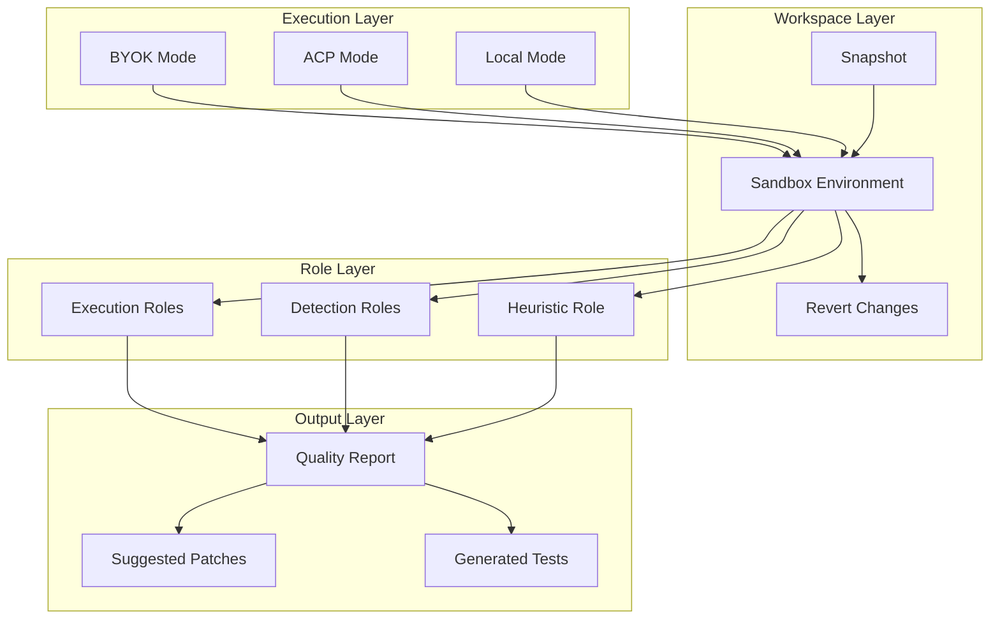

# Core Concepts

Understanding SuperQode's core concepts is essential for effective quality engineering. This section explains the fundamental ideas that power SuperQode.

---

## Quick Navigation

<div class="grid cards" markdown>

-   **Three Execution Modes**

    ---

    Learn about BYOK, ACP, and Local modes for connecting to AI models and agents.

    [:octicons-arrow-right-24: Explore modes](modes.md)

-   **Authentication**

    ---

    Understand how SuperQode handles API keys with full transparency.

    [:octicons-arrow-right-24: Learn about auth](authentication.md)

-   **Ephemeral Workspace**

    ---

    Understand how SuperQode isolates changes and protects your code during testing.

    [:octicons-arrow-right-24: Learn about workspaces](workspace.md)

-   **QE Roles**

    ---

    Discover the different testing roles and how they work together.

    [:octicons-arrow-right-24: Explore roles](roles.md)

-   **Quality Reports**

    ---

    Learn about QRs - research-grade forensic reports with evidence and recommendations.

    [:octicons-arrow-right-24: Understand QRs](qr.md)

-   **Allow Suggestions**

    ---

    Understand the opt-in suggestion workflow where agents can demonstrate fixes.

    [:octicons-arrow-right-24: Learn about suggestions](suggestions.md)

-   **What is SuperQE?**

    ---

    Understand SuperQE (Agentic Quality Engineering) and how it relates to SuperQode.

    [:octicons-arrow-right-24: Learn about SuperQE](superqe.md)

</div>

---

## The SuperQode Philosophy

SuperQode is built on several key principles:

### 1. Sandbox-First

All testing happens in isolated ephemeral workspaces. Your production code is **never modified** without explicit consent.

```
┌─────────────────────────────────────────────────────────────┐
│                    SANDBOX GUARANTEE                         │
├─────────────────────────────────────────────────────────────┤
│                                                              │
│   Original Code        →        Snapshot Created            │
│         ↓                              ↓                     │
│   QE Sandbox           ←        Agents Test Freely          │
│         ↓                              ↓                     │
│   Session Ends         →        Changes Reverted            │
│         ↓                              ↓                     │
│   Original Restored    ←        Artifacts Preserved         │
│                                                              │
└─────────────────────────────────────────────────────────────┘
```

### 2. Multi-Agent Validation

Multiple agents with different roles and models challenge each other, reducing blind spots:

- Different models have different strengths and weaknesses
- Cross-model validation increases finding confidence
- Diverse perspectives catch more issues

### 3. Human-in-the-Loop

SuperQode **suggests**, never **applies**:

- All findings require human review
- Suggested fixes must be approved
- Patches are preserved as artifacts
- Final decisions remain with humans

### 4. Evidence-Based Reporting

QRs are research-grade forensic reports:

- Every finding includes reproduction steps
- Evidence is collected and documented
- Root cause analysis is provided
- Fix suggestions include verification results

---

## How Concepts Connect



---

## Key Terminology

| Term | Definition |
|------|------------|
| **BYOK** | Bring Your Own Key - Direct LLM API calls using your API keys |
| **ACP** | Agent Client Protocol - Full coding agent integration |
| **QE** | Quality Engineering - The process of ensuring software quality |
| **QR** | Quality Report - Forensic quality report |
| **Role** | A specialized testing persona (security_tester, api_tester, etc.) |
| **Harness** | Validation system for patches and code changes |
| **Sandbox** | Isolated environment for testing |
| **Artifact** | Output from QE session (patches, tests, reports) |

---

## Concept Deep Dives

### Execution Modes

SuperQode supports three ways to connect to AI:

| Mode | Description | Best For |
|------|-------------|----------|
| **BYOK** | Direct API calls via LiteLLM | Cloud providers (Anthropic, OpenAI) |
| **ACP** | Full coding agent capabilities | Advanced automation (OpenCode) |
| **Local** | Self-hosted models | Privacy, cost control |

[:octicons-arrow-right-24: Learn more about modes](modes.md)

### Ephemeral Workspace

The workspace system ensures safety:

- **Snapshot**: Original state captured before testing
- **Isolation**: Changes don't affect your repository
- **Revert**: Automatic cleanup after testing
- **Artifacts**: Patches and tests are preserved separately

[:octicons-arrow-right-24: Learn more about workspaces](workspace.md)

### QE Roles

Roles represent specialized testing personas:

- **Execution Roles**: Run existing tests deterministically
- **Detection Roles**: AI-powered issue discovery
- **Heuristic Role**: Senior QE comprehensive review

[:octicons-arrow-right-24: Learn more about roles](roles.md)

### Quality Reports

QRs transform QA outputs from tickets to decisions:

- Investigation summary with methodology
- Findings with evidence and reproduction steps
- Root cause analysis
- Verified fix suggestions

[:octicons-arrow-right-24: Learn more about QRs](qr.md)

### Allow Suggestions

The opt-in workflow for demonstrating fixes:

1. Agent detects issue
2. Agent fixes in sandbox
3. Fix is verified with tests
4. Evidence is collected
5. Changes are reverted
6. Patches are preserved for review

[:octicons-arrow-right-24: Learn more about suggestions](suggestions.md)

---

## Next Steps

- [What is SuperQE?](superqe.md) - Understanding SuperQE and SuperQode
- [Three Modes](modes.md) - Understanding BYOK, ACP, and Local
- [Ephemeral Workspace](workspace.md) - How code isolation works
- [QE Roles](roles.md) - The role-based testing model
- [Quality Reports](qr.md) - Understanding QRs
- [Allow Suggestions](suggestions.md) - The fix demonstration workflow
