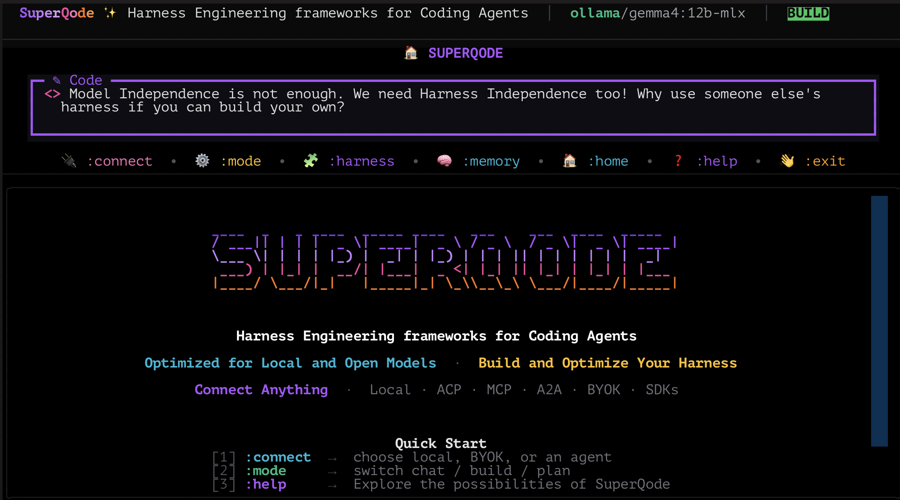

<div class="sq-hero" markdown>


# SuperQode

<p class="sq-kicker">The <span class="sq-gradient-text">terminal-first Software Factory</span> for coding agents</p>

<p class="sq-tagline">Orchestrate multiple harnesses. Run durable work. Evaluate every result. Govern and improve how agents operate. Use local or cloud runtimes from one CLI.</p>

<p class="sq-badges">
  <a href="https://pypi.org/project/superqode/"></a>
  <a href="https://pypi.org/project/superqode/"></a>
  <a href="https://github.com/SuperagenticAI/superqode/blob/main/LICENSE"></a>
  <a href="https://github.com/SuperagenticAI/superqode"></a>
</p>

[Build Your First Harness](getting-started/bring-your-own-harness.md){ .md-button .md-button--primary }
[Optimize Local Models](local-agentic-coding.md){ .md-button }
[Read Harness Engineering](harness-engineering.md){ .md-button }



</div>

---

## Up and running in 60 seconds

```bash
uv tool install superqode    # or run without installing: uvx superqode
cd your-project
superqode
```

This installs the latest [SuperQode release](https://pypi.org/project/superqode/) from PyPI.

That launches the interactive TUI. Connect a model, then start working:

```text
:connect local ollama <open-model>      # a local server you run
:connect byok <provider> <model>        # a hosted provider with an API key
:connect acp <agent>                    # an installed ACP coding agent
```

Prefer scripts and CI? See the headless examples below.

For local and Open Model work, generate a starter harness that belongs to your
repo:

```bash
superqode local init --repo .
superqode --harness superqode.local.yaml
```

Use `local init` for the fastest owned-harness path. Use `local build` when you
want the guided builder for a specific model, endpoint, or model pack.

---

## Overview

SuperQode is a terminal-first Software Factory for coding agents. It combines multi-harness orchestration with durable execution, evaluation, governance, and guarded optimization. Builders can define how agents work, run them across local or cloud runtimes, verify the resulting changes, and improve the harness from recorded evidence.

The core artifact is a repository-owned `HarnessSpec` that defines model routing, tools, memory, context, search, approvals, sandboxing, workflows, evaluation, and optimization. Harness engineering is the practice. Reliable delivery and harness independence are the outcomes.

---

## Build. Measure. Extend. Optimize.

Harness engineering is the discipline after prompt engineering and context engineering: design the system around the model so it works reliably. SuperQode gives you four moves on a harness you own.

<div class="grid cards" markdown>

-   :octicons-tools-16:{ .lg .middle } **Build**

    ---

    Author a harness as a versioned `harness.yaml`. Use the wizard, start from a model-family template, and read what it does in plain English with `harness explain`.

    [:octicons-arrow-right-24: Bring Your Own Harness](getting-started/bring-your-own-harness.md)

-   :octicons-graph-16:{ .lg .middle } **Measure**

    ---

    Prove behavior before you trust it: eval scorecards, agentic benchmarks, and regression gates that fail a candidate which breaks a task the baseline solved.

    [:octicons-arrow-right-24: Run, Measure, Optimize](advanced/harness-optimization.md)

-   :octicons-plug-16:{ .lg .middle } **Extend**

    ---

    Run the same contract across runtimes, providers, MCP, ACP, and A2A. Swap models, memory, search, or tools without rewriting the workflow.

    [:octicons-arrow-right-24: Runtime Backends](runtimes.md)

-   :octicons-rocket-16:{ .lg .middle } **Optimize**

    ---

    Improve model routes, harnesses, and skills with staged candidates a human adopts, so a failure gets fixed once instead of retried.

    [:octicons-arrow-right-24: Optimization Story](advanced/optimization.md)

</div>

---

## Main Capabilities

<div class="grid cards" markdown>

-   :octicons-package-16:{ .lg .middle } **Harness specification**

    ---

    Write a `harness.yaml` that pins runtime, model policy, tools, memory, search, sandbox, approvals, and workflow. Validate it with `harness doctor`, commit it, and run the same contract anywhere.

    [:octicons-arrow-right-24: Bring Your Own Harness](getting-started/bring-your-own-harness.md)

-   :octicons-git-branch-16:{ .lg .middle } **Harness independence**

    ---

    Keep the agent loop inspectable and versioned in your repo. SuperQode lets teams measure, change, and improve the harness itself instead of depending on a locked product harness.

    [:octicons-arrow-right-24: What Is Harness Engineering](harness-engineering.md)

-   :octicons-cpu-16:{ .lg .middle } **Model routing**

    ---

    Use Open Models or closed models, local endpoints or remote providers, small utility models or large coding models. The harness remains the portable configuration layer.

    [:octicons-arrow-right-24: Runtime Backends](runtimes.md)

-   :octicons-cpu-16:{ .lg .middle } **Local first Open Model support**

    ---

    Detect local engines, probe real context windows, generate starter harnesses, smoke test readiness, repair weak tool calls, and benchmark local candidates.

    [:octicons-arrow-right-24: Local Agentic Coding](local-agentic-coding.md)

-   :octicons-workflow-16:{ .lg .middle } **Local dynamic workflows with RLM**

    ---

    Use local recursive language-model runs for large logs, traces, diffs, and repo-slice audits. `context_handle`, `spawn_harness`, and bounded dynamic workflow scripts keep evidence outside the prompt while preserving replayable lineage.

    [:octicons-arrow-right-24: Local Recursive Dynamic Coding](local-recursive-dynamic-coding.md)

-   :octicons-graph-16:{ .lg .middle } **Evaluation and optimization**

    ---

    Use harness tests, eval scorecards, local route optimization, harness optimization, and skill optimization. Stage changes and adopt them only after regression gates pass.

    [:octicons-arrow-right-24: Optimization Story](advanced/optimization.md)

-   :octicons-workflow-16:{ .lg .middle } **Terminal-first Software Factory**

    ---

    Move from a repo-owned HarnessSpec to durable role-aware WorkOrders, isolated workers, terminal operations, verified delivery, and evidence-backed harness improvement.

    [:octicons-arrow-right-24: Software Factory](advanced/software-factory.md)

-   :octicons-search-16:{ .lg .middle } **Local code intelligence**

    ---

    Give models the right context with bounded reads, local code search, multi repo search, semantic search, offline indexes, and post edit verification.

    [:octicons-arrow-right-24: Multi-Repo Search & Edit Safety](advanced/multi-repo-search.md)

-   :octicons-shield-lock-16:{ .lg .middle } **Airplane Mode**

    ---

    Prepare a strict offline harness with local repositories, local model servers, local indexes, cached metadata, and network tools removed.

    [:octicons-arrow-right-24: Airplane Mode](advanced/airplane-mode.md)

-   :octicons-database-16:{ .lg .middle } **Configurable memory**

    ---

    Local first agent memory supports remember, search, forget, and export operations. Connect provider neutral memory systems when needed.

    [:octicons-arrow-right-24: Memory & Learning](advanced/memory.md)

-   :octicons-tools-16:{ .lg .middle } **Policy controlled tools**

    ---

    Bounded reads, shell sessions, patch edits, vision attachments, MCP tools, web tools, and verification hooks are gated by explicit permissions and sandbox policy.

    [:octicons-arrow-right-24: Tools Catalog](advanced/tools-catalog.md)

-   :octicons-plug-16:{ .lg .middle } **Runtime and protocol integrations**

    ---

    Connect to existing runtimes, SDKs, MCP tools, ACP agents, and A2A workflows while keeping the harness as the portable contract.

    [:octicons-arrow-right-24: Connection Modes](concepts/modes.md)

</div>

---

## Feature Reference Map

Every major product surface has a dedicated reference page. Start with the area
you are changing, then use the CLI reference when you need exact flags.

| Area | Documentation |
| --- | --- |
| CLI commands | [CLI Reference](cli-reference/index.md) |
| TUI commands | [TUI Reference](advanced/tui.md) |
| Harness specs, workflows, evals, and events | [Harness System](advanced/harness-system.md) |
| Runtime backends and SDK adapters | [Runtime Backends](runtimes.md) |
| Providers, model catalog, and connection profiles | [Models & Providers](providers/index.md) |
| Local and Open Model workflows | [Local Agentic Coding](local-agentic-coding.md) |
| Tools, search, MCP, and permissions | [Tools Catalog](advanced/tools-catalog.md) |
| Safety, sandboxing, and approvals | [Safety & Permissions](advanced/safety-permissions.md) |
| Sessions, sharing, memory, and logging | [Session Management](advanced/session-management.md) |
| Software Factory, WorkOrders, workers, and delivery gates | [Terminal-First Software Factory](advanced/software-factory.md) |
| Omnigent similarities, differences, and interoperability | [How SuperQode Relates to Omnigent](advanced/superqode-vs-omnigent.md) |
| Plugins, skills, and optimization | [Plugin Authoring](advanced/plugin-authoring.md) |
| Automation, channels, MCP, ACP, and A2A | [Advanced Workflows](advanced/index.md) |
| Environment variables and YAML config | [Configuration](configuration/index.md) |

The release checks include a CLI documentation coverage test so new command
groups are not added without a reference page.

---

## See it work

=== "Interactive TUI"

    ```text
    :connect local          # pick a local model server
    :plan fix the tests     # review the plan before tools run
    :plan approve           # execute it
    :context                # check the detected context window
    :local optimize         # benchmark candidates and generate role routes
    ```

    Type while the agent works and your message steers the current run between tool calls.

=== "Headless"

    ```bash
    superqode -p --mode json "summarize the architecture" | jq .success
    superqode -p --resume 4f2a "continue where we left off"
    superqode sessions export 4f2a --format html -o run.html
    ```

=== "Harness contract"

    ```yaml
    # harness.yaml: the portable run contract
    name: my-coder
    flavor: coding
    runtime:
      backend: builtin
    model_policy:
      primary: ollama/gemma4
      tool_call_format: prompt    # for models without a native tool head
    execution_policy:
      sandbox: docker
      approval_profile: ask
    ```

    ```bash
    superqode harness run --spec harness.yaml --prompt "make the smallest safe fix"
    superqode harness events <run-id>
    ```

=== "CI quality gate"

    ```bash
    superqode -p \
      --sandbox git-worktree \
      --rubric "the full test suite passes; the diff is minimal" \
      --output-schema fix-report.schema.json \
      "find one failing test and fix it properly" > report.json

    jq -e '.schema_valid and .success' report.json
    ```

---

## How a run works

```text
1. SPEC       Choose coding, no-tool, or custom harness behavior
2. MODEL      Apply model policy, local hints, fallback rules, and prompt profile
3. RUNTIME    Select builtin, OpenAI Agents, ADK, Codex SDK, Claude Agent SDK, DeepAgents, or PydanticAI
4. TOOLS      Attach repository tools, MCP tools, validation hooks, or no tools
5. SESSION    Persist history, stream events, compact context, store runs, resume work
6. WORKFLOW   Run single, chain, parallel, router, orchestrator, or evaluator-optimizer flows
7. RESULT     Return text, diffs, typed data, events, and validation state
```

Every stage is observable: `superqode harness events <run-id>` shows the normalized event graph regardless of which runtime executed the work.

---

## Learn it in order

Each step builds on the previous one.

1. **Install and run**: [Installation](getting-started/installation.md), then [Your First Session](getting-started/first-session.md)
2. **Connect your models**: [Providers](providers/index.md) for hosted APIs, [Local Models](providers/local.md) for Ollama, LM Studio, MLX, vLLM, and DS4
3. **Understand the engine**: [Inside the Agent Loop](advanced/agent-loop.md) and the [Tools Catalog](advanced/tools-catalog.md)
4. **Make it yours**: [Harness System](advanced/harness-system.md) for portable run contracts, [Policies & Safety](advanced/policies.md) for guardrails
5. **Build the factory**: [Terminal-First Software Factory](advanced/software-factory.md) for WorkOrders, workers, evidence, delivery, and improvement
6. **Automate**: [Headless & CI](advanced/headless-ci.md) for scripts, pipelines, and schema-validated output
7. **Go further**: [Developer Workflows](developer-workflows.md), [Multi-Agent Workflows](advanced/multi-agent.md), [Runtime Backends](runtimes.md), [Plugin Authoring](advanced/plugin-authoring.md)

---

<div class="sq-footer-cta" markdown>

**Ready?** [Install SuperQode](getting-started/installation.md){ .md-button .md-button--primary } or start with the [Harness Guide](getting-started/bring-your-own-harness.md).

</div>
