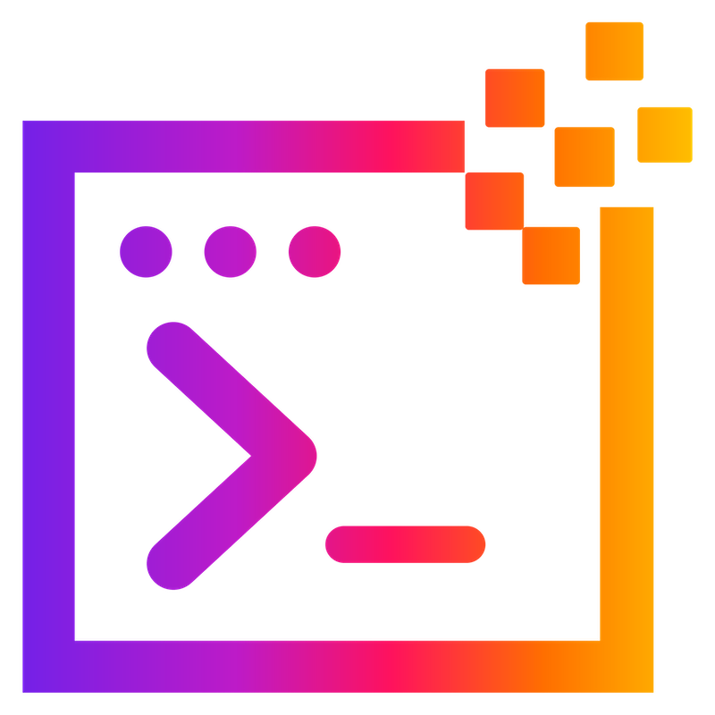
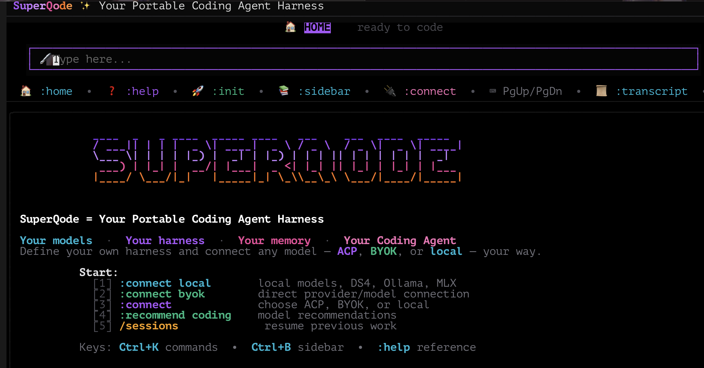

<div class="sq-hero" markdown>



# SuperQode

<p class="sq-kicker">Portable Coding Agent Harness Framework</p>

<p class="sq-tagline">Turn open models into serious coding agents. Your harness, your models, your memory. Built for Local Agentic Coding, connected to everything else through BYOK, ACP, agent SDKs, MCP, and A2A.</p>

<p class="sq-badges">
  <a href="https://pypi.org/project/superqode/"></a>
  <a href="https://pypi.org/project/superqode/"></a>
  <a href="https://github.com/SuperagenticAI/superqode/blob/main/LICENSE"></a>
  <a href="https://github.com/SuperagenticAI/superqode"></a>
</p>

[Get Started](getting-started/installation.md){ .md-button .md-button--primary }
[Inside the Agent Loop](advanced/agent-loop.md){ .md-button }
[View on GitHub](https://github.com/SuperagenticAI/superqode){ .md-button }

</div>



---

## Up and running in 60 seconds

```bash
uv tool install superqode    # or: pip install superqode
cd your-project
superqode
```

That is the full interactive TUI. For scripts and CI, run one task and print the answer:

```bash
superqode --print "inspect this repository and suggest the smallest safe cleanup"
```

---

## Why teams pick SuperQode

<div class="grid cards" markdown>

-   :octicons-package-16:{ .lg .middle } **Built-in harness, or define your own**

    ---

    Start coding immediately with the built-in harness, or write a `harness.yaml` that pins runtime, model policy, tools, sandbox, approvals, and workflow. Validate it with `harness doctor`, commit it, and run the same contract anywhere.

    [:octicons-arrow-right-24: Configuration vs Harness](concepts/configuration-vs-harness.md)

-   :octicons-cpu-16:{ .lg .middle } **Local Agentic Coding, first-class**

    ---

    `superqode local doctor` recommends the right engine and model for your machine and generates a tuned harness. `superqode local optimize` benchmarks local/open candidates and generates per-role routing for planner, implementer, reviewer, and utility agents. Underneath: live context-window detection, adaptive compaction, model policy packs, tool-call repair, doom-loop guards, and prompt-based tool calling for models without a tool head.

    [:octicons-arrow-right-24: Local Agentic Coding](local-agentic-coding.md)

-   :octicons-tools-16:{ .lg .middle } **35+ policy-controlled tools**

    ---

    Bounded reads, spill-to-disk shell output, interactive PTY sessions, patch-envelope edits, vision attachments, and web access. Every tool gated by permissions, exec-policy rules, and sandboxing.

    [:octicons-arrow-right-24: Tools Catalog](advanced/tools-catalog.md)

-   :octicons-plug-16:{ .lg .middle } **All three protocols**

    ---

    MCP client and server, ACP agent connections, and A2A serving and calling, in one product. Expose your harnesses as MCP tools with a single command.

    [:octicons-arrow-right-24: Serve Commands](cli-reference/serve-commands.md)

-   :octicons-stack-16:{ .lg .middle } **Pluggable runtimes**

    ---

    Run the same harness on the builtin engine, OpenAI Agents SDK, Google ADK, Codex SDK, Claude Agent SDK, DeepAgents, or PydanticAI. Swap engines without rewriting workflows.

    [:octicons-arrow-right-24: Runtime Backends](runtimes.md)

-   :octicons-people-16:{ .lg .middle } **Multi-agent, supervised**

    ---

    One-shot sub-agents, long-lived peer agents you can steer mid-run, external A2A agents, and rubric self-grading to hold unattended work to a standard.

    [:octicons-arrow-right-24: Multi-Agent Workflows](advanced/multi-agent.md)

-   :octicons-shield-check-16:{ .lg .middle } **Safety as policy, not hope**

    ---

    Declarative allow/deny/ask rules for shell commands, secret filtering for spawned processes, OS sandboxing, permission escalation with consent, and hard denies nothing can override.

    [:octicons-arrow-right-24: Policies & Safety](advanced/policies.md)

-   :octicons-terminal-16:{ .lg .middle } **Headless and CI-ready**

    ---

    JSON event output, schema-validated answers with automatic correction, rubric quality gates, session exports to Markdown, JSON, or shareable HTML, and disposable worktree isolation.

    [:octicons-arrow-right-24: Headless & CI](advanced/headless-ci.md)

-   :octicons-database-16:{ .lg .middle } **Memory that stays yours**

    ---

    Local-first agent memory with explicit control: remember, search, forget, export. Plug in mem0, Cognee, Supermemory, or SpecMem when you want more, and opt in to the full loop: automatic capture of durable facts from completed runs, and automatic recall when they matter again.

    [:octicons-arrow-right-24: Memory & Learning](advanced/memory.md)

</div>

---

## See it work

=== "Interactive TUI"

    ```text
    :connect local          # pick a local model server
    :plan fix the tests     # review the plan before tools run
    :plan approve           # execute it
    :context                # check the detected context window
    :compare gpt-5.4 gemma4 # same prompt, two models, side by side
    ```

    Type while the agent works and your message steers the current run between tool calls.

=== "Headless"

    ```bash
    superqode -p --mode json "summarize the architecture" | jq .success
    superqode -p --resume 4f2a "continue where we left off"
    superqode sessions export 4f2a --format html -o run.html
    ```

=== "Harness contract"

    ```yaml
    # harness.yaml: the portable run contract
    name: my-coder
    flavor: coding
    runtime:
      backend: builtin
    model_policy:
      primary: ollama/gemma4
      tool_call_format: prompt    # for models without a native tool head
    execution_policy:
      sandbox: local
      approval_profile: ask
    ```

    ```bash
    superqode harness run --spec harness.yaml --prompt "make the smallest safe fix"
    superqode harness events <run-id>
    ```

=== "CI quality gate"

    ```bash
    superqode -p \
      --sandbox git-worktree \
      --rubric "the full test suite passes; the diff is minimal" \
      --output-schema fix-report.schema.json \
      "find one failing test and fix it properly" > report.json

    jq -e '.schema_valid and .success' report.json
    ```

---

## How a run works

```text
1. SPEC       Choose coding, no-tool, or custom harness behavior
2. MODEL      Apply model policy, local hints, fallback rules, and prompt profile
3. RUNTIME    Select builtin, OpenAI Agents, ADK, Codex SDK, Claude Agent SDK, DeepAgents, or PydanticAI
4. TOOLS      Attach repository tools, MCP tools, validation hooks, or no tools
5. SESSION    Persist history, stream events, compact context, store runs, resume work
6. WORKFLOW   Run single, chain, parallel, router, orchestrator, or evaluator-optimizer flows
7. RESULT     Return text, diffs, typed data, events, and validation state
```

Every stage is observable: `superqode harness events <run-id>` shows the normalized event graph regardless of which runtime executed the work.

---

## Learn it in order

Each step builds on the previous one.

1. **Install and run**: [Installation](getting-started/installation.md), then [Your First Session](getting-started/first-session.md)
2. **Connect your models**: [Providers](providers/index.md) for hosted APIs, [Local Models](providers/local.md) for Ollama, LM Studio, MLX, vLLM, and DS4
3. **Understand the engine**: [Inside the Agent Loop](advanced/agent-loop.md) and the [Tools Catalog](advanced/tools-catalog.md)
4. **Make it yours**: [Harness System](advanced/harness-system.md) for portable run contracts, [Policies & Safety](advanced/policies.md) for guardrails
5. **Automate**: [Headless & CI](advanced/headless-ci.md) for scripts, pipelines, and schema-validated output
6. **Go further**: [Developer Workflows](developer-workflows.md), [Multi-Agent Workflows](advanced/multi-agent.md), [Runtime Backends](runtimes.md), [Plugin Authoring](advanced/plugin-authoring.md)

---

<div class="sq-footer-cta" markdown>

**Ready?** [Install SuperQode](getting-started/installation.md){ .md-button .md-button--primary } or watch the [demo video](https://www.youtube.com/watch?v=x2V323HgXRk).

</div>
