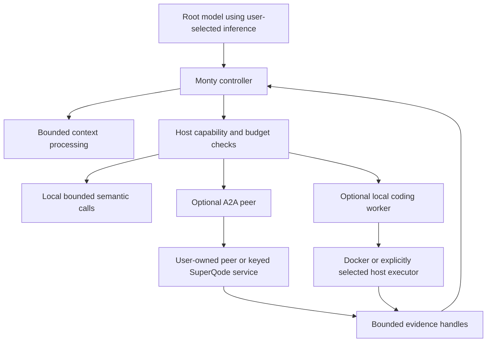

# Optional A2A routing and Monty: cost-control addendum

Research date: 4 October 2026. This supplements the [original A2A/RLM plan](a2a-in-native-rlm-2026-10-04.md). The existing A2A implementation and native RLM remain the foundation. Proposed configuration, commercial entitlements and routing APIs below are not implemented.

## Decision

Keep A2A as additional, explicitly enabled support. A valid SuperQode key makes a hosted route available; installing the key alone must not activate routing or spending. Users can keep their current model and execution route, opt into a self-hosted/third-party A2A peer, or opt into a SuperQode-hosted agent with a key and an authorized budget.

Use **Pydantic Monty** as a first-class lightweight orchestration and context-processing profile. This is the project assumed from the user's reference to Monty. It can run the model's orchestration Python and invoke the A2A bridge through narrow host capabilities. Preserve host and Docker for full coding execution. Move the Monty bridge forward in the original plan, after explicit worker limits and lifecycle safeguards; there is no technical need to defer it until local persistent messaging is complete.

Monty can reduce sandbox overhead. Opt-in routes, bounded model calls and durable quotas control inference costs. These are separate savings; replacing Docker with Monty does not make inference free.

## Preserve the RLM computation model

Apply the [original plan's RLM principles](a2a-in-native-rlm-2026-10-04.md#rlm-principles-that-every-stage-must-preserve) to every routing and sandbox option. The intended flow is:

```text
large context held as data
  → model-written Python searches and selects relevant fragments
  → bounded semantic calls, local children or opted-in A2A agents
  → results retained as handles in the environment
  → root selects evidence, synthesizes and verifies
```

Monty executes the context-processing and orchestration program. The host performs permitted model/agent calls on its behalf. A2A is one optional destination for those calls; disabling it must leave local semantic subcalls and the supported local-child path available under the selected profile. Adding local children to Monty requires the explicit supervisor capability proposed below, since that profile currently exposes semantic subcalls but not child sessions.

Cost policy constrains this program's admissible work rather than substituting a routing-only architecture. Keep decomposition model-directed, persist intermediate state, cap recursion and spending at the host, and retrieve only useful result slices. Cheap execution should reduce overhead and unnecessary context transfer while preserving useful reasoning capacity.

Release evaluation must include a long-context task that measures root context growth, selected fragment volume, subcall count, source-grounded synthesis and answer quality. A passing A2A transport test or a fast Monty snippet is insufficient evidence that the RLM design works. Compare reductions in cost against task quality so aggressive limits do not erase the benefit of recursion.

## Who pays, and when

| Route | Product access | Compute/inference payer | Default behavior |
| --- | --- | --- | --- |
| Local model and local Monty | Available without a hosted-service key | User's machine; no SuperQode-hosted inference | Appropriate for low-cost analysis/orchestration |
| User-configured model API and local sandbox | Existing access | User's provider account | Keep existing route unless changed |
| User-owned or third-party A2A peer | Opt-in standard protocol support | User or peer operator under their agreement | Requires endpoint, credentials if needed, and route selection |
| SuperQode-hosted specialist | Optional key plus eligible service entitlement | SuperQode incurs cost; recover through credits/subscription or explicit bounded trial subsidy | Off until enabled and budget-authorized |
| Anonymous SuperQode shortlist | Existing public capability | SuperQode serves deterministic catalogue computation, hosting and network overhead | No hosted model call for anonymous requests |

Free product users can still use the open protocol against their own agents. Charge for SuperQode-provided compute or specialist service, rather than requiring payment merely to speak A2A. This is a recommendation for the product boundary, not a change to pricing or current licensing.

“No SuperQode-hosted inference cost” does not mean no total cost. Local inference uses hardware and electricity; a user API key may incur provider charges; public deterministic endpoints still require hosting. A2A is a transport and task contract, not a cost-reduction mechanism by itself.

For a free path, keep orchestration, context filtering and verification on the user's machine. Do not relay every local subcall through our hosted endpoint. For the paid path, start with a small number of bounded specialist tasks that supply distinct value, instead of unrestricted hosted recursive root sessions.

## Optional routing contract

Separate four decisions: model provider, controller sandbox, execution backend, and remote-agent routing. A key should not select any of them implicitly.

Illustrative configuration only:

```yaml
runtime:
  backend: rlm
  config:
    sandbox: monty
    a2a:
      enabled: false
      peers: []
      hosted_enabled: false
      max_hosted_credits: 0
      paid_fallback: false
```

An opted-in hosted peer could be configured through our existing connection UI and a credential reference, with an explicit session/task credit cap. A user-owned peer needs its own credential reference. Keep secret values out of YAML, model context and snapshots. The exact schema should be implemented through validated RLM configuration, not copied into current releases expecting enforcement.

Proposed model surface:

```python
local_answer = llm_query("Explain this invariant", context=selected_text)

# This peer appears only when enabled by host configuration.
job = a2a.start(peer="superqode-reviewer", task=review_request,
                context=selected_bundle)
```

The host checks route permission, peer identity, skill entitlement, payload size, budget and deadline before submitting. The model can choose among permitted routes but cannot enable one, change a credential, raise its quota, or turn on paid fallback.

An unavailable or exhausted paid route returns a structured refusal with actionable status. Continue locally only if that fallback was configured and fits the task; never silently move from local work into paid hosting. Do not expose unavailable hosted skills as executable capabilities to the model.

Preserve direct `llm_query` semantics. An optional future `a2a.query` helper could return an RLM-style response handle for a bounded remote question, but must retain remote task state and billing provenance. Do not make an existing direct inference call secretly start a hosted agent session.

## Our existing hosted foundation

[Customer keys](https://github.com/SuperagenticAI/superqode/blob/main/src/superqode/a2a/keys.py) already carry signed identity, customer, tier, issue time and expiry, with revocation support. Missing credentials and invalid credentials are handled distinctly. [Server shortlist handling](https://github.com/SuperagenticAI/superqode/blob/main/src/superqode/a2a/server.py) already uses a deterministic keyword path for anonymous callers; keyed callers can optionally use one model interpretation call. [Request interpretation](https://github.com/SuperagenticAI/superqode/blob/main/src/superqode/a2a/understand.py) caps input at 800 characters and model output at 512 tokens.

This is a useful existing split to preserve. A paying user should not need a model call to fetch a card, discover a peer, get cached status, or retrieve an already-produced artifact. For straightforward shortlist inputs, deterministic parsing can remain the first path even for keyed users; more expensive interpretation can be explicitly requested or triggered by measured uncertainty within quota.

However, [rate limits](https://github.com/SuperagenticAI/superqode/blob/main/src/superqode/a2a/limits.py) are explicitly in-memory and best-effort. They reset with process state and do not establish a durable account balance across replicas. Signed key expiry does not cap spending. The executor also uses a deployment-level `harness_skill_enabled` gate; it does not yet implement the proposed per-customer paid skill/budget policy. Enabling a hosted harness on a deployment that allows anonymous access therefore needs an explicit per-skill entitlement gate before executing model work.

Do not treat “any nonanonymous tier” as a paid account: current keys can assert a trial tier, and tier labels are not a billing ledger. Keep the current public pilot shortlist scope while preparing a separately gated hosted specialist deployment.

### Minimum server-side metering

1. Keep signed customer keys as identity, with durable account entitlements and credit balance stored separately. Customer keys must never inherit the operator token's exempt limits.
2. Before model work, transactionally reserve a bounded amount of credits against the account. All replicas use the same authoritative ledger. Use integer units, not floating-point balances.
3. Enforce admitted model/token/turn/delegation limits inside the executing worker. A reservation based only on estimated consumption is not a hard ceiling. Include retries, child calls and model-backed request interpretation.
4. Settle the reservation from execution usage or the documented bounded-task tariff. Use a separate computational-work identity for settlement; repeated GetTask, polling or stream reconnection must not charge again for the same computation.
5. Persist uncertain submissions and billing reservations. Do not release a reservation just because the caller disconnected if work may still run. Recovery reconciles execution and billing without duplicate submission.
6. Give trials explicit small credits, expiry and concurrency caps. Rate limiting remains a separate abuse/availability control.

Start with bounded task credits and explicit model/output limits rather than promising arbitrary remote cost estimates. For third-party peers, spending and cancellation guarantees depend on that peer; unknown usage stays unknown. Do not subsidize an automatic chain of third-party tasks through our provider credentials.

## Why Monty is useful here

Current Monty is a Rust Python interpreter with a pooled worker API, persistent REPL state, suspend/resume support and host callbacks. The OSS project is MIT licensed; paid Full Monty is a separate service option. We can use the installed local OSS package without requiring a hosted Monty service. [Official project](https://github.com/pydantic/monty).

Pydantic AI's Code Mode is a concrete adjacent design: it uses Monty to let model-written Python compose tools and filter results before returning them to model context. Our native RLM already has its own loop and programming surface, so the relevant lesson is the capability bridge; adopting Pydantic AI's entire harness is unnecessary. [Code Mode](https://pydantic.dev/docs/ai/harness/code-mode/).

For our A2A bridge, Monty receives functions such as `_a2a_start`, `_a2a_poll`, `_a2a_reply`, and `_a2a_result_slice`. These call the same root-owned delegation manager proposed in the original plan. Credentials, endpoints, pricing and persistent task state remain on the host. Monty sees an opaque delegation ID and bounded result data. A host callback executes with host authority, so it must validate peer, ownership, quotas and payload itself. [Host functions](https://pydantic.dev/docs/monty/concepts/host-functions/).

Do not expose an arbitrary HTTP fetcher, unrestricted shell callback, or entire client object as a convenience shortcut. Monty has no ambient filesystem/network capability; explicitly exposed host functions and mounts determine access. Worker processes provide crash isolation but do not turn Monty into an OS sandbox. [Security model](https://pydantic.dev/docs/monty/concepts/security/).

Current upstream offers opt-in filesystem access through mounts and host callbacks. Our existing native [Monty profile](https://github.com/SuperagenticAI/superqode/blob/main/src/superqode/rlm/kernel_monty.py) intentionally refuses repository writes and shell commands. Preserve that useful contract for the initial route. Adding `shell.run` as a host callback would make command execution inherit whichever executor receives it; Monty itself would not isolate that subprocess.

### Controller plus executor



Monty can be the main controller while Docker starts only when repository commands, dependencies or test execution are needed. Reuse an execution environment within a session rather than repeatedly starting one per tool call. This hybrid saves potential startup/idle overhead but requires explicit execution dispatch and verification provenance; it is not current behavior.

The host can also start a bounded local child from a Monty callback. Monty does not need subprocess support inside the interpreter to request that action. Our present profile omits the supervisor bridge as an implementation choice; adding a narrowly scoped host child capability is technically possible. Child model work still consumes inference budget, and shared root caps must apply.

Keep host/Docker profiles for full coding sessions. Offer Monty early for analysis, coordination and context processing; evaluate before making it the default for newly created orchestration sessions. Do not silently switch existing coding users to a profile that refuses their writes and tests. Other sandbox backends can implement the existing kernel/executor contracts later; capability declarations must name what each actually supports. [Alternatives comparison](https://pydantic.dev/docs/monty/reference/alternatives/).

Host mode remains an explicit local option. Do not execute customer-generated host Python beside shared hosted credentials and metering state. A hosted coding executor needs its own enforced boundary; Monty's isolated controller does not extend its guarantees to an unrestricted downstream worker.

## Monty adapter gaps before hosted or cost-sensitive use

Source inspection found:

| Current behavior | Needed change |
| --- | --- |
| `Monty()` uses implicit pool sizing and request timeouts | Configure bounded workers, checkout deadlines and worker request backstops |
| `checkout(script_name=...)` passes no explicit limits | Pass memory, feed/turn execution, recursion, suspension and sleep limits |
| Outer `asyncio.wait_for(asyncio.to_thread(...))` times out | Explicitly release/discard the checkout and revoke that generation's callback admission; timing out an await does not stop an already-running thread or remote action |
| `close_kernel` drops its dictionary entry but contexts live in the ExitStack | Audit prompt release of worker checkouts and idle eviction; dropping a handle alone is not evidence of resource release |
| Printed fragments accumulate in an unbounded list | Enforce output byte limits while collecting, before concatenating |
| Checkpoint/restore writes and reads raw snapshot bytes without configured size enforcement | Bound snapshot size, pin worker compatibility, verify trusted storage/integrity, and reapply host policy after restore |
| No A2A host external functions | Add plain-data proxies and bind them to the shared root manager |

Monty supports memory, execution and suspension limits, but interpreter time excludes time waiting for callbacks; its memory accounting is not a process-RSS ceiling. Use separate host callback/request/task deadlines and infrastructure process limits for hosted operation. Runtime limits are not a durable model-spend meter. Restoring state must not reset our account/root allowance. [Resource limits](https://pydantic.dev/docs/monty/concepts/resource-limits/).

Snapshots retain state but do not authenticate their provenance, and compatible worker/runtime versions matter. Never accept arbitrary customer-supplied snapshots as trusted state; use controlled storage or authenticated snapshots. A restored delegation handle must be checked against current ownership, entitlement, route permission and deadline, in addition to the policy in the saved heap. [Snapshots](https://pydantic.dev/docs/monty/concepts/snapshots/).

## Cost-reduction ideas, in priority order

1. **Do not create extra work by default.** Hosted routing off, no separate paid routing-classifier call, no automatic remote fan-out. Give the existing root a compact inventory of approved capabilities.
2. **Filter before inference.** Monty can search, deduplicate, chunk and aggregate local data; send only necessary fragments. Bound result previews and retrieve larger artifacts by slice.
3. **Use a cheap permitted model for focused subcalls.** Let users choose local or their own provider routes per role. Escalate to a higher-cost configured route only within explicit policy. Evaluate quality before selecting defaults.
4. **Cache safe deterministic work.** Agent cards, parsed context, exact-revision chunk analysis and catalogue retrieval can be reused. Cache keys must include task/prompt/model/policy versions where applicable and respect tenant boundaries. Re-run tests after changes; cached verification is not fresh verification.
5. **Prefer bounded specialists.** A hosted reviewer of selected evidence is easier to price and constrain than a remote unrestricted coding root. Start with concurrency one and a small delegation ceiling as candidate defaults, then measure.
6. **Pool and release resources.** Bounded Monty pools, session-scoped Docker reuse, idle eviction and slim result retention target infrastructure cost without changing answer quality. Sleeping hosted agents and unlimited snapshots still cost storage/memory.
7. **Stop duplicate work.** Durable submission state, coordinated cancellation and required-dependency tracking prevent retries from turning one request into several billable agents.

Operator cost can be decomposed as hosted inference + execution compute + retained state + network/operations. Monty addresses part of execution compute; local/BYOK routes shift inference responsibility to the user; bounded delegation and context reduce the amount of inference. None should be presented as measured monetary savings until workload tests establish them.

## Local experiment and limitations

Inspected upstream Monty at `3f9d6ef413fb951e5b80113b7088d535bd028fcb` (1 October); ran the installed `pydantic-monty` 1.0.0. The standalone offline probe lives at `/private/tmp/superqode-monty-cost-probe-20261004.py` and uses a fake task manager, no credentials, no model calls and no network requests.

Verified that host callbacks can return a plain task handle; disabled routing does not admit work; a host credit check refuses a second task; the handle survives a dump/load cycle; memory and interpreter execution caps fire; importing `socket` fails; reading an unmounted `/etc/passwd` fails. This is feasibility evidence, not a production billing, concurrency or real-peer test.

On this machine, five cold pool-to-first-result trials had a median of 3.108 ms; 100 warm checkout/feed/release cycles for `1 + 1` had a median of 0.044 ms. The memory limit rejected a 20 MB allocation against an 8 MB allowance; a 50 ms interpreter cap stopped an infinite loop in about 50.4 ms. The snapshot was 1,235 bytes. These are tiny local microbenchmarks, not RLM turn latency or a comparative Docker benchmark, and they do not quantify token-cost savings.

Existing focused checks:

```bash
PYTEST_DISABLE_PLUGIN_AUTOLOAD=1 .venv/bin/python -m pytest \
  -p pytest_asyncio.plugin \
  tests/rlm/test_rlm_monty_kernel.py tests/rlm/test_rlm_sandbox.py \
  tests/test_a2a_keys.py tests/test_a2a_limits.py -q
```

Result: **50 passed** in 0.38 seconds. No production code or hosted entitlement changed.

## Revised delivery sequence

Preserve the original client corrections and durable manager. Add a routing/entitlement policy contract at the manager boundary. Implement the Monty safeguards and A2A proxies alongside the host/Docker surfaces rather than waiting for retained local messaging.

The first release should provide optional user-owned A2A routing and an improved Monty orchestration profile. Keep the current public shortlist service. A SuperQode-hosted paid specialist pilot follows only once per-skill entitlement, durable reservations and worker-side limits are implemented. A full paid remote root is a later scope decision, not required for this feature.

Acceptance checks must establish: disabled route causes no remote submission or reservation; a stored key alone does not enable routing; anonymous/trial requests cannot bypass hosted entitlement; concurrent replicas cannot spend the same balance twice; status/reconnect does not settle twice; restore does not refresh quota; worker timeout releases resources and blocks late admissions; and host/Docker/Monty display the correct capabilities and verification origin.

Compare the same tasks and model budgets with host, Monty and Docker controller profiles, separating cold from warm operation. Measure inference usage, quality, bytes exposed to the root, worker RSS/idle occupancy, time, remote submissions, duplicate admissions and recovery. This decides which profile should become the new-session default and whether the proposed savings materialize.
