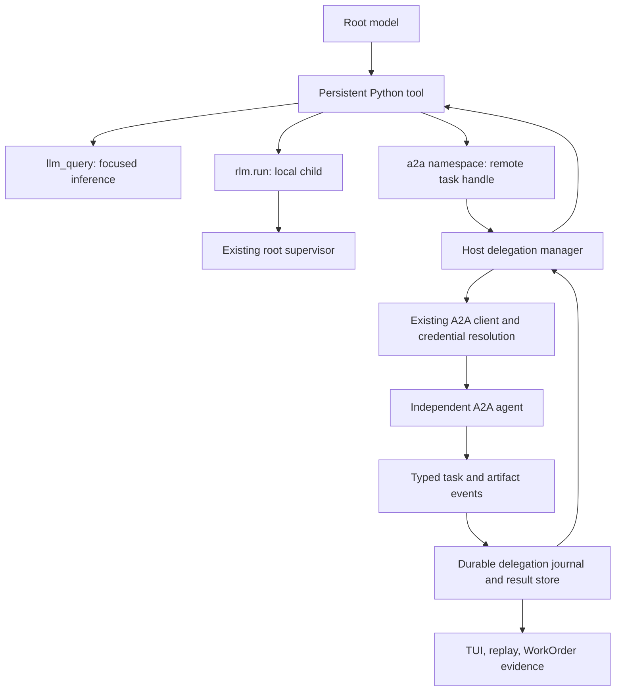

# A2A inside SuperQode's native RLM: research and implementation plan

Research date: 4 October 2026. This document proposes a design; the proposed Python API and configuration are not shipped functionality.

Follow-up: [Optional routing, customer keys and Monty cost-control research](a2a-cost-routing-and-monty-2026-10-04.md) preserves this architecture, adds opt-in hosted routing, and recommends bringing the Monty bridge forward after resource safeguards.

## Recommendation

Make the existing open Agent2Agent protocol an active capability of the native RLM by injecting an `a2a` namespace into its persistent Python environment. The model should choose a configured peer, submit a bounded task, continue local work, inspect progress, answer clarification requests, and retrieve evidence through durable handles. The resident root worker should own execution and recovery.

Keep three explicit operations:

| Operation | Purpose | Execution owner |
| --- | --- | --- |
| `llm_query(...)` | Focused semantic inference over selected text | Existing subcall executor and model provider |
| `rlm.run(...)` | Full local child coding session | Existing root supervisor |
| Proposed `a2a.start(...)` | Delegate to an independent agent, potentially on another machine or framework | New host-owned delegation manager using the existing A2A client |

The model actively invokes A2A through generated Python, and the harness executes the protocol. No model-weight change or provider API change is needed. Turning every inference request into an A2A task would add session, network, and lifecycle costs to operations that do not need them.

The immediate priority is client correctness followed by a durable outbound bridge. Persistent parent/sibling mailboxes and inbound RLM serving can follow. Do not replace our native RLM with Prime, introduce an HTTP hop for every local child, or build another independent scheduler.

## RLM principles that every stage must preserve

The Recursive Language Model remains the core computation model. Monty supplies an execution boundary, and A2A supplies an optional delegation transport. Neither alone makes a system an RLM.

1. **Context is data.** Keep the corpus and intermediate results in the environment. The root receives bounded metadata and selected observations, rather than the entire repository or remote transcript.
2. **The model programs its investigation.** Persistent Python lets it search, select, chunk, decompose, ask focused questions, and synthesize results. Routing must not replace this with a fixed workflow graph.
3. **Recursive computation is available and bounded.** Preserve `llm_query` and full local child sessions; permit remote agent work when explicitly enabled. Descendants inherit the root's admission policy and limits. Python call-stack limits and agent-recursion limits are separate controls.
4. **Results remain addressable data.** Return response/task/artifact handles with bounded previews and source provenance. The root decides which slices enter subsequent inference.
5. **The root owns synthesis and verification.** Delegation provides evidence; it does not transfer the completion decision. Required child work and local acceptance gates must be resolved before completion.

An individual task may need no recursion; that does not require forcing extra calls. The harness must retain the RLM capabilities and use them when decomposition is useful. Evaluation should demonstrate corpus narrowing, bounded subcalls and evidence synthesis on a long-context task, alongside successful remote routing.

## Research scope and evidence

I inspected SuperQode at `9cc8c158b844b3be54df8f51536f3adde704783e`, the current upstream Prime checkout at `c24ac227f11f552ed1d3fa8ebc7d916937d7f6bc` (3 October), the original RLM paper, Prime's paper and launch explanation, the current A2A specification and release notes, the official Python SDK, and Google's ADK integration example.

Prime was freshly cloned into a temporary directory. This matters: search results and our comparison documentation describe an earlier TypeScript implementation; the current upstream `main` contains Rust crates and a Python runtime. Source links below pin the inspected Prime revision. The installed SuperQode environment has `a2a-sdk` 1.1.2. Protocol and SDK version numbers are separate.

This was source and specification research with local tests and parser probes. I did not run Prime against a paid model, perform a live inter-framework integration, or independently reproduce published performance claims. Recommendations and estimated implementation scope are engineering judgments, not measured performance results.

## What Prime actually does

Prime's launch describes persistent REPL computation and messaging between retained child agents and sessions. Its paper describes daemon-mediated asynchronous queues, stable session relationships, and runtime state outside active model context. These explain how recursive delegation and subsequent collaboration remain accessible across turns. [Launch explanation](https://www.primeintellect.ai/blog/prime-agent), [Prime paper, sections 2.2-2.4](https://arxiv.org/html/2608.23552v1).

In the inspected implementation, the model-facing messaging route is:

```text
model generates Python
  → agent_message.send(message, receiver_role=..., receiver_name=...)
  → rlm.host_request("agent_message.send", payload)
  → host messaging controller resolves a related session
  → direct worker transport, or supervisor-routed send_message
  → recipient session receives the message
  → sender receives a delivery receipt
```

The Python messaging package is a thin bridge. It validates the addressing shape, calls the host, and renders the receipt. Parent addressing does not need a name; sibling and child addressing do. A broadcast form also exists. A delivery receipt means delivered or queued, not that the requested work has succeeded. [Messaging shim](https://github.com/PrimeIntellect-ai/prime-agent/blob/c24ac227f11f552ed1d3fa8ebc7d916937d7f6bc/skills/agent-message/src/agent_message/__init__.py).

The host resolves family membership from durable parent/session edges rather than trusting names. Other top-level sessions count as siblings. Current direct delivery obtains a single-use worker grant; supervisor fallback is permitted when the direct link was never established. Once delivery was sent but acknowledgment was lost, it surfaces uncertainty instead of sending the same work through the fallback. Retained children can be addressed through durable identities. These are useful reliability patterns to adopt. [Family identity](https://github.com/PrimeIntellect-ai/prime-agent/blob/c24ac227f11f552ed1d3fa8ebc7d916937d7f6bc/crates/pa-daemon/src/agent_messaging.rs), [Delivery implementation](https://github.com/PrimeIntellect-ai/prime-agent/blob/c24ac227f11f552ed1d3fa8ebc7d916937d7f6bc/crates/pa-daemon/src/agent_messaging/message.rs), [Daemon lifecycle](https://github.com/PrimeIntellect-ai/prime-agent/blob/c24ac227f11f552ed1d3fa8ebc7d916937d7f6bc/crates/pa-daemon/README.md).

`rlm.spawn(...)` returns a handle after admission. It retains the wire operation name `rlm.run` for compatibility. Current `rlm.collect(..., timeout_ms=0)` provides an immediate typed snapshot; positive timeouts provide bounded collection. The host owns child execution. This is a useful separation between accepting work, collecting results, and messaging. [Python RLM runtime](https://github.com/PrimeIntellect-ai/prime-agent/blob/c24ac227f11f552ed1d3fa8ebc7d916937d7f6bc/prime-agent-runtime/src/rlm/__init__.py).

**Finding:** Prime's advertised agent-to-agent communication is custom session messaging in the inspected implementation. I found no standard A2A Agent Card route, `message/send` route, or A2A SDK integration in that checkout. That is evidence about this revision, not a claim that Prime can never support the standard through an extension. Calling its internal messaging “A2A” does not establish open-protocol interoperability.

A search trap: Google's ADK quickstart also names a remote `prime_agent`. That example checks whether numbers are prime; it is unrelated to Prime Intellect. It does demonstrate a framework wrapping an external A2A agent as an agent capability. [ADK consuming quickstart](https://adk.dev/a2a/quickstart-consuming/).

Two documentation corrections should accompany future implementation: our [RLM comparison](../advanced/rlm-routes.md) describes the earlier TypeScript host and uses `rlm.run` in Prime examples; current public Python naming is `rlm.spawn`. Also, inspect the actual prompt/tool configuration before claiming Prime always exposes exactly one model tool: the current source contract lists `bash`, `edit`, and `ipython`, while product prose emphasizes the REPL programming model. [Current source contract](https://github.com/PrimeIntellect-ai/prime-agent/blob/c24ac227f11f552ed1d3fa8ebc7d916937d7f6bc/AGENTS.md).

## How the open A2A protocol fits

The latest listed specification release is v1.0.1, with 1.0 as the protocol version negotiated on the wire. Preserve explicit 0.3 compatibility where peers advertise it. Do not confuse that with the separately versioned SDK. [Protocol releases](https://github.com/a2aproject/A2A/releases), [Official Python SDK compatibility](https://github.com/a2aproject/a2a-python#-compatibility).

The Agent Card advertises skills, accepted media, interfaces, optional capabilities, and security requirements. Discovery locates the card; the client selects a supported advertised interface. A skill description helps routing but does not prove competence or grant authorization. [Agent discovery](https://a2a-protocol.org/latest/topics/agent-discovery/).

An interaction can return a direct `Message` or a stateful `Task`. A `contextId` groups related interactions; a `taskId` identifies one unit of work; a `messageId` identifies an individual message. A terminal task cannot restart. Follow-up work creates a new task within the same context, optionally referencing prior tasks. These semantics differ from repeatedly waking a retained Prime session. [Task lifecycle](https://a2a-protocol.org/latest/topics/life-of-a-task/).

For long work, use streaming or explicit nonblocking submission, then subscription or bounded polling. Streaming carries task snapshots, status changes, messages, and artifact updates. A stream ending alone should not make our orchestrator infer successful completion; reconcile the task's state. Polling remains necessary for peers without streaming. [Streaming and asynchronous operations](https://a2a-protocol.org/latest/topics/streaming-and-async/).

Current operations include `SendMessage`, `SendStreamingMessage`, `GetTask`, `CancelTask`, and `SubscribeToTask`. Preserve `AUTH_REQUIRED` separately from `INPUT_REQUIRED`. Sending is not universally idempotent: server deduplication using `messageId` is optional. [Current specification site](https://a2a-protocol.org/latest/specification/).

There is an upstream binding discrepancy worth resolving before changing code: the current specification site lists REST subscription as POST, but the published v1.0.1 protobuf specifies GET at `/tasks/{id}:subscribe`. Our existing GET matches the published definition. Local source inspection also confirms that the installed SDK 1.1.2 client sends POST for REST and `SubscribeToTask` for JSON-RPC. Pin the released protocol/SDK contract for compatibility tests and verify actual peer behavior before choosing a REST binding. The JSON-RPC name `TaskResubscription` differs from both the documented operation and installed SDK. [Released v1.0.1 protocol definition](https://github.com/a2aproject/A2A/blob/v1.0.1/specification/a2a.proto).

Version 1 changes interface declarations, JSON enum representation, parts, and response/event discrimination. Select and serialize for the negotiated version instead of mixing old and new representations. [Migration details](https://a2a-protocol.org/latest/whats-new-v1/).

A2A handles independent agent delegation; MCP exposes tools and resources. Both can be called from an RLM environment, but an A2A task does not expose the remote agent's internal prompt, kernel, or tools. [A2A and MCP](https://a2a-protocol.org/latest/topics/a2a-and-mcp/).

RLM's reason for using this surface is compositional: context remains data, and the root program chooses small semantic calls, local children, or remote expertise. A2A does not itself create RLM recursion or choose the decomposition strategy. [Original RLM paper](https://arxiv.org/abs/2512.24601).

## What SuperQode already has

| Existing component | Reuse | Boundary or limitation |
| --- | --- | --- |
| [A2A client](../../src/superqode/a2a/client.py) | Card discovery; JSON-RPC 1.0/0.3 and HTTP+JSON; send/get/cancel/stream/subscribe | Hand-written client parsing needs fixes below; no gRPC client despite its introductory docstring |
| [A2A server](../../src/superqode/a2a/server.py) | Official SDK routes, task store, ownership checks, mapping to Harness Protocol | Already maps A2A context to a resumable session; selecting and serving native RLM needs integration verification |
| [Connection configuration](../../src/superqode/a2a/connection.py), [OAuth](../../src/superqode/a2a/oauth.py), [trust review](../../src/superqode/a2a/trust.py) | Existing credentials and inspection surfaces | Headless runtime must use configured credentials and surface auth needs without initiating interactive UI |
| [Registry](../../src/superqode/a2a/registry.py) | URL-bound identity and collision rejection | Registry `verified` currently means successful discovery, not proven skill quality |
| [Ordinary A2A tools](../../src/superqode/a2a/tools.py) | Existing flat-loop capability | `a2a_call` is registered in the full registry, but native RLM deliberately constructs `tools=[python]` |
| [Native coding session](../../src/superqode/rlm/coding_session.py) | Composition root and Docker host bridge | Add a typed `a2a.*` operation family rather than another model tool |
| [Root worker](../../src/superqode/rlm/root_worker.py), [supervisor](../../src/superqode/rlm/supervisor.py) | Detach survival, child lineage, event journals and global tree limits | Local `send`/`steer` reject completed children; persistent idle-session messaging is additional work |
| [Semantic subcalls](../../src/superqode/rlm/subcalls.py) | Context-as-data response pattern, host-owned accounting | Keep focused tool-free inference separate from remote agent tasks |
| [WorkOrders](../../src/superqode/workorders/models.py), [evidence](../../src/superqode/workorders/evidence.py) | Acceptance decisions, typed evidence, worker task budgets | Remote completion should become evidence, not automatic acceptance or merge |

The public pilot documented in [A2A provider docs](../providers/a2a.md) serves shortlist work, not general repository execution. A future RLM delegation example must target a separately configured harness-capable deployment; do not silently send coding tasks to that pilot.

## Verified gaps to fix first

These findings concern the current client and its consumers. They do not invalidate the existing server's separate conformance results.

| Finding | Evidence | Required behavior |
| --- | --- | --- |
| Direct message response is lost | `send_message` always calls `_parse_task`; a `{message: ...}` probe returns a blank `submitted` task with no answer | Use a typed Task-or-Message result and retain IDs and all parts |
| Authentication state is collapsed | `TASK_STATE_AUTH_REQUIRED` maps to `input_required` | Preserve the distinction and report credential action to the host/UI |
| 0.3 input state is misread | A literal `input-required` probe falls through to `submitted` | Normalize legacy hyphenated states explicitly; unknown states become protocol errors |
| File artifacts lose content location | `_parse_task` ignores `url` and `raw`; a URL artifact probe retains filename/media but has `file=None` | Preserve all part variants and metadata, with bounded storage |
| Subscription needs contract reconciliation | Client sends `TaskResubscription` for 1.0 JSON-RPC; REST GET matches released proto but rolling docs and installed SDK client use POST | Use JSON-RPC `SubscribeToTask`; resolve REST discrepancy with compatibility tests against actual peers |
| Streams are untyped raw payloads | Streaming methods wrap each `data:` line without normalization or artifact assembly | Parse SSE framing and JSON-RPC errors, normalize events, merge artifact chunks correctly |
| Old one-shot tool is insufficient | It has no continuation arguments, closes after one send, treats `working` as success, and extracts one history part capped at 500 characters | Return a durable task handle, distinguish accepted/running from completed, retrieve full artifacts on demand |
| Task admission is not explicitly nonblocking | `_message_params` has no execution-mode option | Serialize version-appropriate nonblocking configuration; expose separate request timeout and task deadline |

The parser probes were read-only calls against existing functions. They produced:

```text
immediate reply: task_id='', state='submitted', history=[], context_id=None
TASK_STATE_AUTH_REQUIRED: 'input_required'
URL file artifact: file=None
0.3 'input-required': 'submitted'
```

Prefer official SDK transport/validation behind our public wrapper if its hooks can preserve the existing authentication, interface selection, inspection, and compatibility behavior. This decision needs a small compatibility spike. If those hooks are insufficient, retain the wrapper's transport and validate with SDK models. Avoid a wholesale client rewrite bundled with the RLM bridge.

## Proposed architecture



The root worker owns one delegation manager for its entire tree. Child sessions get scoped capabilities to that manager, not fresh quota counters. The manager shares a root admission budget with local children where configured, while separately tracking remote limits and spending. Authentication and HTTP clients stay outside Docker/Monty kernels. The same Python programming model should work in all supported profiles.

An outbound A2A capability can work through a host bridge while Docker keeps `--network none`. That is a deliberate, separately enabled egress capability, not blanket network access. Monty can eventually use injected host external functions without acquiring filesystem or process access; its current implementation has semantic/context externals but no general supervisor bridge. Implement host and Docker first, then add explicit Monty externals and behavioral parity tests.

Under the `host` profile, generated Python already has host-process permissions; namespace checks alone cannot establish an adversarial security boundary. Enforce strong host-owned limits under isolated profiles and describe host-mode controls honestly.

### Proposed model-facing API

The following is a design example, not executable with the current release:

```python
peers = a2a.peers(skill="security-review")  # configured registry only
evidence = context.select("src/auth/**/*.py")
bundle = a2a.export_context(evidence, max_bytes=32_000)

job = a2a.start(
    peer="security-reviewer",
    task="Review token rotation; return findings with source locations.",
    context=bundle,
    deadline_seconds=180,
)

local = rlm.run("Inspect token-rotation tests and identify missing cases")
snapshot = job.status()  # local cached snapshot, includes observation time
snapshot = job.poll()    # bounded refresh from the remote peer

if snapshot.state == "input_required":
    job.reply("Assess replay after refresh, including concurrent requests.")

remote_result = job.wait(timeout=20)  # bounded wait returns a snapshot
if remote_result.completed:
    findings = remote_result.artifacts.read_text("findings")
    print(remote_result.summary(max_chars=1200))
```

`start` returns on bounded admission, including an already completed direct-message response. It raises only an admission/configuration failure; ambiguous submission outcomes remain explicitly recorded. `wait` must not interpret its timeout as remote cancellation or task failure. Handles also expose `cancel()` and `follow_up(...)`.

`reply` addresses an active task using its remote task/context identifiers. `follow_up` creates a new task in the existing remote context after completion. It returns a new handle. Do not offer generic remote `steer()` as though standard A2A guarantees mid-turn interruption; a peer may accept additional messages but its scheduling semantics are its own.

Keep full results in the host result store. `repr(handle)` and `summary()` are bounded. Artifact slices are fetched through the bridge; credentials and live client objects never enter kernel checkpoints. A restored handle contains opaque local identity only and rebinds to a journal record owned by that session.

### Proposed durable record

Store at least: delegation ID; root, parent and calling session IDs; pinned peer endpoint/binding/version/tenant; credential reference; remote context/task IDs; stable outbound message IDs; message/task response kind; observed state and timestamp; admission outcome; deadline; dependency flag; exported bundle digest and source revision; artifact references and hashes; cancellation request/outcome; budget reservations; usage source/confidence; event sequence and generation.

Use explicit state transitions: `admitting`, `submitted`, `working`, `input_required`, `auth_required`, `completed`, `failed`, `rejected`, `cancel_requested`, `canceled`, `unknown`. Unknown outcomes and expired local deadlines do not invent terminal remote states. Record that a response completed without a remote task ID when the peer returned a direct Message.

On restart, reconstruct records and reconcile known remote tasks with `GetTask`; reconnect streams only where supported. Do not resubmit a task simply because the root worker restarted. Persist intent before sending and acknowledgment afterward. A lost acknowledgment before learning the task ID remains unresolved unless that peer has an agreed deduplication/reconciliation facility. Stable `messageId` alone cannot promise exactly-once execution.

Artifact events require assembly by artifact ID and arrival sequence, respecting append/last-chunk semantics. Reconnection may repeat snapshots; avoid duplicating already materialized content. When no replay cursor is guaranteed, reconcile with an authoritative task snapshot instead of assuming lossless event replay.

### Root completion and result delivery

Do not mark the objective complete while a required delegation is working, awaiting input/authentication, or has unresolved submission outcome. Optional/background delegations must be explicitly marked and remain visible in the final evidence.

For the first bridge, the model collects through status/poll/wait and gets bounded events during turns. Host receipt of remote updates must continue when the TUI detaches. Later, add a durable inbox and an explicit wake policy: queue updates during an active turn; start an idle continuation only when the session policy permits it. Coalesce progress updates to avoid generating one model turn per remote token.

Root supervision and remote task execution are separate. Canceling locally requests remote cancellation and records the result; disconnecting or exhausting a local wait does not assert that the remote agent stopped.

## Scope, policy, and routing choices

Use configured peers and capabilities for the initial release. Agent-card descriptions help the model select a peer from that bounded set. Binding an alias to an endpoint is a host configuration action; a remote card name must never retarget it. Pin interface URL, version and tenant for an admitted task. Validate redirects and advertised cross-origin interfaces before attaching credentials. Reuse existing trust inspection and ownership checks, but enforce the outbound bridge's endpoint policy before sending any payload.

Export selected, bounded context with revision/path/offset provenance. A local `file:` or repository context handle is not remotely meaningful. Convert it into text/data parts or a controlled artifact URL; do not transmit the entire workspace by default. Returned URLs are references, not permission to fetch arbitrary resources. Fetch with an explicit origin/size/media policy, then store locally with a digest.

Treat returned text and patches as evidence. A remote security reviewer can provide findings; a patch-producing peer can provide a patch artifact. Apply patches through our existing local edit/WorkOrder path, run local completion gates, and make an acceptance decision there. The remote peer cannot grant itself repository-write, merge, or credential authority.

Use root-level concurrency and delegation count caps; separate payload/response sizes, deadlines, and retry ceilings; and persistent admission reservations. Known peer prices can support preflight spending reservations. A2A does not guarantee token or price telemetry, and a remote server can continue spending after our deadline. Unknown remote usage stays unknown, with request/time limits and contractual peer budgets where available. Do not show an unknown remote charge as zero or describe local accounting as a hard remote-spend guarantee.

Pass trace lineage and requested budgets in optional metadata initially. Receivers can ignore metadata, so it is descriptive unless a peer agreement makes it enforceable. Standard A2A does not define a global recursion budget across unrelated hosts. Prevent known loops locally, cap our tree, and negotiate a required versioned extension only when distributed budget enforcement becomes necessary. [Extension mechanism](https://a2a-protocol.org/latest/topics/extensions/).

## Staged implementation plan

Each stage should be a separately reviewable change. Host and Docker support form the initial native-RLM milestone; Monty and retained-session messaging extend it.

| Stage | Concrete change | Main locations | Acceptance gate |
| --- | --- | --- | --- |
| 1. Client contract fixes | Typed Task-or-Message responses, complete state/part preservation, version-correct subscription, typed SSE and explicit nonblocking send | `a2a/client.py`, `types.py`, consumers in `reply.py`, `tools.py`, `workflows.py` | Fixtures for independent 1.0 and 0.3 peers, direct Message, artifact-only results, auth/input distinctions, fragmented SSE, protocol errors |
| 2. Durable delegation manager | Admission, deadline/cancel state, polling/stream tracking, scoped ownership, journal/result storage, credential resolution and budget reservation | Proposed `rlm/delegation.py`, `delegation_store.py`, `delegation_policy.py`; resident root lifecycle | Crash between send and acknowledgment stays unknown; restart reconciles known task without another send; detach retains tracking; cancel does not falsely report success |
| 3. RLM Python surface | `a2a` namespace and opaque handles; host implementation and Docker proxies; prompt documentation | `rlm/kernel.py`, `kernel_server.py`, `coding_session.py`, adapter configuration | Model sees only `python`; identical host/Docker behavior; no credentials enter container, handle or checkpoint; result previews remain bounded |
| 4. Inbound serving and observability | Bind a configured native RLM adapter through the current A2A executor; show peers/tasks/artifacts/unknown usage in existing tree/replay; import WorkOrder evidence | `a2a/server.py`, `harness/rlm_adapter.py`, root events, `app/mixins/rlm_commands.py`, WorkOrder integration | Standard A2A client can start/cancel a native RLM task; required remote dependency prevents early completion; another principal cannot retrieve or cancel it |
| 5. Retained local messaging and Monty | Durable parent/child/sibling inbox, scoped cross-root addressing, idle continuation, profile-specific Monty externals | Existing supervisor/root command protocol; `kernel_monty.py` | Replies can reach a parent; completed child can receive a new turn without mutating the old run; restart neither drops nor repeats inbox messages; Monty policy parity |
| 6. Evaluation and release docs | Comparative task pack, failure injection, routing instructions and current Prime comparison | Existing harness eval packs and RLM/A2A docs | Demonstrated correctness and useful quality/cost/latency tradeoff before automatic routing |

The first bridge should work without the retained-local-mailbox stage. A2A already supports conversational contexts; rebuilding Prime's entire daemon family model is not a prerequisite for remote tasks.

Initial routing should be model-directed and opt-in. Give the model a compact inventory describing each approved peer's intended role, limits, and evidence format. Encourage remote use when a peer has distinct tools, data, execution capacity, or expertise, and local semantic calls for cheap chunk analysis. Add deterministic automatic routing only after evaluations show where it improves outcomes.

### Integration with Prime itself

Keep our existing Prime RPC backend for operating Prime sessions. To expose Prime to the same RLM `a2a` surface, bind an A2A server around a verified Prime-capable Harness Protocol adapter. The translation is A2A task/context lifecycle to Prime session/RPC lifecycle, with explicit cancellation and evidence mapping. Our Prime HarnessSpec backend is not proof that every RPC operation is automatically a compatible Harness Protocol session adapter; verify that composition before advertising it.

This would make a Prime-powered peer interoperable through our gateway. It would not convert Prime's internal daemon messaging into the open A2A standard. Pin and test Prime versions because upstream architecture is changing.

## Evaluation design

Use the same root model, task fixtures, source revision, and comparable allowed context/budgets across four conditions: flat harness; native RLM with semantic calls/local children; native RLM with A2A specialists; and, optionally, Prime through our existing backend. Also compare direct local versus loopback A2A execution of the same specialist to isolate transport overhead from specialist quality.

Start with three tasks: an authentication audit with planted defects and evidence locations; a long CI-log investigation with one planted root cause; and a small migration where a remote reviewer provides a patch/finding that local tests can verify. A specialist's additional tools or data must be disclosed so an apparent win is not incorrectly attributed to the protocol alone.

Measure task success using executable gates and expected findings; evidence precision and coverage; total tokens and known/unknown cost separately; wall time and time to first useful evidence; root prompt growth; number of remote tasks and retries; payload bytes; cancellation latency; and recovery without duplicate work. Repeat stochastic model trials with fixed configurations and report variation. Do not promise a speed or accuracy improvement from architecture alone.

Failure injection should cover: immediate Message reply; artifact-only task; input/auth required; refusal/failure/cancel rejection; unsupported streaming; disconnect before acknowledgment; worker crash after admission; stale/expired task; duplicated artifact snapshot; fragmented/multiline SSE; redirect or card endpoint change; malicious artifact text; out-of-policy artifact URL; parent deadline while remote still runs; and a peer attempting another delegation back to the caller.

Run protocol compatibility independently of model evaluations. Existing server TCK coverage does not establish correctness of our outbound client, durable RLM bridge, or multi-host budget accounting.

## Local validation performed

Baseline command:

```bash
PYTEST_DISABLE_PLUGIN_AUTOLOAD=1 .venv/bin/python -m pytest \
  -p pytest_asyncio.plugin \
  tests/test_a2a_bridge.py tests/test_a2a_connect.py \
  tests/test_a2a_registry.py tests/rlm/test_native_rlm.py \
  tests/rlm/test_rlm_root_runtime.py tests/rlm/test_rlm_sandboxed_kernel.py -q
```

Result: **138 passed, 1 skipped** in 4.87 seconds. The run emitted 102 warnings, including SDK/protobuf deprecations and SQLite worker teardown warnings. This establishes the existing baseline; it does not test the proposed bridge. Read-only probes separately reproduced four parsing gaps listed above. Subscription concerns include an upstream documentation/proto discrepancy and need independent-peer reproduction in stage 1.

The implementation-ready next step is stage 1 followed by stages 2-3: correct our client contract and make remote agents callable as durable capabilities from the native RLM's existing Python tool.
