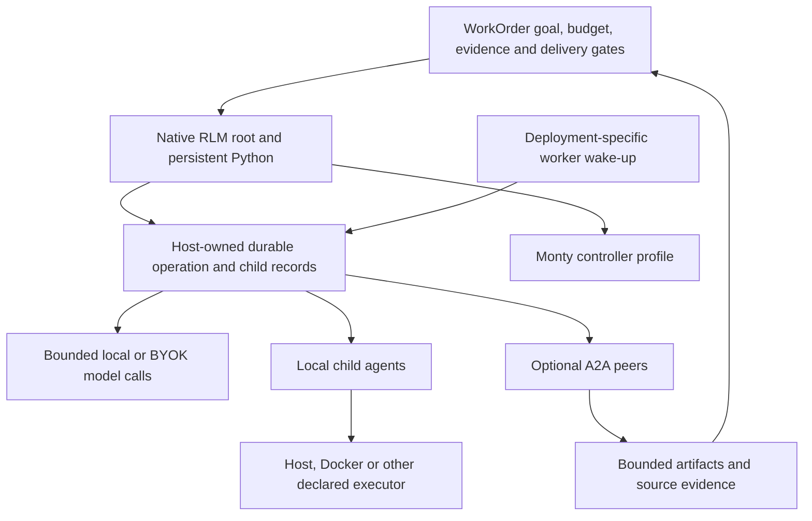

# Pi Durable, WorkOrders, and durable RLM: exploratory comparison

Research date: 2026-10-04. This is a separate exploration, not an amendment to the accepted [RLM/A2A plan](a2a-in-native-rlm-2026-10-04.md) or its [optional routing and Monty addendum](a2a-cost-routing-and-monty-2026-10-04.md). No runtime behavior was changed.

## Finding

**Our idea fits Pi Durable's direction. We already have several comparable recovery mechanisms, plus a coding delivery contract that Pi Durable does not supply as a built-in product.** The opportunity is to combine durable recursive reasoning, evidence-backed delivery, and explicit cost admission. We cannot yet claim superior reliability, task quality, or cost without comparable fault and workload evaluations.

Pi Durable primarily answers: “How does an agent conversation and its owned work continue after interruption?” WorkOrders also answers: “Which exact repository changes have passed checks and review, and may be accepted and merged?” Native RLM adds a third concern: “How can the model process a large corpus through persistent Python and bounded recursive reasoning?” Those concerns fit together, but none substitutes for the others.

The most valuable lesson is consistent durable ownership and admission at every model/tool/child boundary. Copying Pi's entire TypeScript runtime is not necessary to learn from it.

## Sources and scope

I identified the official package as Earendil's `@earendil-works/pi-durable`, announced October 1, 2026. It is explicitly experimental. This is distinct from ordinary Pi terminal-session persistence and unrelated third-party Pi extensions. [Official announcement](https://earendil.com/posts/pi-durable/).

I cloned the official repository and audited revision `200387122ca450d6387f033949423114a270b96c`, dated October 4, 2026. The package manifest at that revision says `1.0.2`; this is the inspected source version, not a claim about every installed or registry version. [Pinned manifest](https://github.com/earendil-works/pi/blob/200387122ca450d6387f033949423114a270b96c/packages/durable/package.json).

SuperQode was inspected at `9cc8c158b844b3be54df8f51536f3adde704783e`. Evidence below separates shipped code, upstream code, and exploratory ideas. Pi's tests and examples were read; its test suite was not executed. Our focused recovery suite was executed offline with deterministic fixtures: **59 passed in 16.77 seconds**. This is evidence of those tested boundaries, not a production comparison.

## What Pi Durable actually built

### One durable runtime for conversation, state, and work

Pi models conversations as immutable transcript entries, mutable typed documents, durable submissions, and checkpointed tasks. A transaction can append an entry, update documents, and create tasks together. The runtime stores a commit before publishing it; an uncertain storage failure poisons the session so it must reopen. This gives applications a coherent state model rather than independent transcript and task logs. [Commit implementation](https://github.com/earendil-works/pi/blob/200387122ca450d6387f033949423114a270b96c/packages/durable/src/session/session.ts).

The built-in tasks cover generation, tool execution, and compaction. Extensions can add versioned tasks, phases, durable waits, and migration functions. Upstream recovery tests explicitly cover interrupted effects, abort phases, missing definitions, and definition handover. [Recovery tests](https://github.com/earendil-works/pi/blob/200387122ca450d6387f033949423114a270b96c/packages/durable/test/harness-tasks-recovery.test.ts).

### Explicit recovery policy for tools; automatic recovery for model requests

Before dispatch, Pi stores final tool arguments and replay policy. On recovery, both the stored policy and current implementation must declare the operation safe before it reruns. Otherwise it records an interrupted result for the model. This is a sensible conservative default for tool effects. [Tool task](https://github.com/earendil-works/pi/blob/200387122ca450d6387f033949423114a270b96c/packages/durable/src/harness/tool.ts).

Generation differs: reopening a request phase sends the model request again. Committed partial output becomes an aborted transcript entry. Partials are committed through a throttled path; model usage and final response are recorded together. These choices improve continuity but do not establish provider exactly-once execution or billing. An interrupted request may already have consumed provider resources. [Generation implementation](https://github.com/earendil-works/pi/blob/200387122ca450d6387f033949423114a270b96c/packages/durable/src/harness/generation.ts).

### Durable children without a built-in specialist-agent framework

The foreground-child example creates a conversation owned by the calling task, finds that same conversation after replay, and submits with a stable request ID. The example removes the subagent extension from the child, so that particular demonstration deliberately prevents further delegation. Durable subagents alone do not establish recursive language model behavior. [Foreground example](https://github.com/earendil-works/pi/blob/200387122ca450d6387f033949423114a270b96c/packages/durable/test/examples/22-subagent-foreground.ts).

The background example uses an ownership anchor, a durable name-to-conversation document, and reporter tasks. Report delivery uses stable IDs and records which answers were reported. It supports steering and follow-ups while the parent continues. Its management tool is explicitly unsafe to replay: repeating a stop might cancel newer work. That detail is directly useful for our proposed delegation manager. [Background example](https://github.com/earendil-works/pi/blob/200387122ca450d6387f033949423114a270b96c/packages/durable/test/examples/23-subagent-background.ts).

Ownership controls completion and cancellation traversal; it is not an access-control capability. Foreground owned work can hold its owner open; background work has different idle/abort semantics. Credential authorization and tenant boundaries remain host responsibilities. [Normative specification](https://github.com/earendil-works/pi/blob/200387122ca450d6387f033949423114a270b96c/packages/durable/docs/spec.md).

### Persistence and automatic wake-up are separate

Pi supplies memory, SQLite, and JSONL storage. Its storage contract assumes one owning process and does not supply cross-process harness locking. The Node SQLite adapter uses WAL with `synchronous=NORMAL`; the README distinguishes process-crash recovery from recent-commit loss on host/power failure. JSONL has an optional fsync mode. [Storage documentation](https://github.com/earendil-works/pi/blob/200387122ca450d6387f033949423114a270b96c/packages/durable/README.md#storage).

Cloudflare adds the missing lifecycle mechanism: `PiHarness` stores Pi tables in a Durable Object and maintains a durable job whose alarm wakes an evicted object. Pi's in-memory scheduler can then reopen storage and continue. This is a real operational advantage of that integration, not an automatic property of importing the package. The integration is beta, and does not define the client's transport. [Cloudflare PiHarness](https://developers.cloudflare.com/agents/harnesses/pi/).

## What we already shipped

The shipped WorkOrder code has meaningful durability, beyond a persisted checklist:

| Concern | Shipped SuperQode behavior | Pi comparison |
|---|---|---|
| Submission deduplication | Request ID bound to a contract fingerprint; changed contracts reject reuse | Pi deduplicates by conversation/request ID and submission type |
| Concurrent workers | Atomic SQLite claims, worker limits, expiring leases, worker/attempt fencing | Pi assumes a single owner of its storage; concurrency is inside that runtime |
| Operation recovery | Intent/result journal, committed-outcome reuse, explicit reconciliation for uncertain unsafe effects | Similar intent/checkpoint pattern; Pi returns interrupted unsafe tools to the model |
| Coding-turn recovery | Opt-in PiPy recovery reconstructs the original branch and original tool-call IDs | Pi recovery is part of its core conversation/task runtime |
| Generated Python recovery | Monty VM suspension and host-call intent committed atomically; revision fencing | Pi persists task phase state; Python VM continuation is not its supplied mechanism |
| Delivery | Task worktrees, dependency integration, conflict evidence, checks, review, candidate-bound approval and guarded merge | Pi provides primitives on which an application could build a delivery system |

Local evidence: [store](../../src/superqode/workorders/store.py), [PiPy recovery](../../src/superqode/harness/pipy_recovery.py), [program journal](../../src/superqode/workorders/programs.py), [runner](../../src/superqode/workorders/runner.py), and [delivery documentation](../advanced/workorders.md).

Two concrete distinctions are particularly useful:

* Pi's submission implementation returns the existing same-type submission even if the newly supplied content differs. Its own test checks this. Our contract-fingerprint rejection is stronger protection against accidental request-key reuse for delivery jobs. This is a deliberate semantic difference, not an upstream defect. [Pi submission logic](https://github.com/earendil-works/pi/blob/200387122ca450d6387f033949423114a270b96c/packages/durable/src/harness/submissions.ts), [our submission tests](../../tests/test_workorder_submissions.py).
* Our WorkOrder database uses `synchronous=FULL`, whereas the inspected Pi Node adapter defaults to NORMAL. That is a stronger local flush setting, with possible performance cost. It does not protect us from losing the machine, storage corruption, or loss of separately stored repository/session files. Neither system's database setting proves whole-system disaster recovery.

## Where Pi is ahead, and where we should be precise

**Pi has a more unified agent-level durability abstraction.** Its transcript, inbox, task ownership, documents, and visible progress share one commit stream. Our WorkOrder transaction boundary is strong, including atomic Monty suspension and intent, but PiPy session files, native RLM kernel state, supervisor journals, and repository effects are separate mechanisms. Do not describe all of them as one atomic durable execution system.

**Pi's Cloudflare integration supplies durable activation.** Our worker service recovers stale leases while running, and can be supervised by systemd, launchd, Kubernetes, or CI. If all workers are stopped, the database itself does not wake one. Local restart supervision and hosted durable wake-up are different deployment choices.

**Pi has clearer generic task migration and ownership semantics.** Our program fingerprint rejects code/capability/runtime changes on restore, which is safe, but long-lived upgrade continuity needs an explicit tested migration policy. Current WorkOrder dependencies are a delivery DAG; RLM ownership is a recursive execution tree. Both relationships are useful and should remain distinct.

**Our conservative provider recovery has a usability cost.** PiPy recovery blocks an unknown model outcome instead of resending. With declared cost/token caps, it also refuses a new model request whose spend cannot be reserved. Ordinary WorkOrder harness accounting is principally admission/completion accounting, so one admitted call can overshoot a monetary limit. We must neither market this as universal provider exactly-once execution nor pretend the durable reservation service in the existing plan already exists. [PiPy request admission](../../src/superqode/harness/pipy_recovery.py), [budget documentation](../advanced/workorders.md#usage-budgets-and-risk-policy).

**Native RLM recovery remains a distinct gap.** It already supports checkpoints, persistent resident workers, and recovery of surviving child workers. Monty exposes idle dump/restore. But a dead child is recorded as interrupted; that is different from replaying every unfinished model/tool operation from a durable task phase. WorkOrders currently admits the whole-harness replay-safe envelope specifically for configured single-mode PiPy recovery, not every RLM session. [RLM supervisor](../../src/superqode/rlm/supervisor.py), [Monty kernel](../../src/superqode/rlm/kernel_monty.py), [RLM adapter](../../src/superqode/harness/rlm_adapter.py), [runner admission](../../src/superqode/workorders/runner.py).

The supervisor's JSONL append also catches write failures and continues. That is suitable evidence of best-effort recovery bookkeeping, not Pi's stronger “visible progress is committed” contract. This is a candidate for exploration rather than a change made by this report.

## Fit with the accepted RLM, A2A, and Monty idea

Keep the RLM concept intact: the corpus stays outside the model prompt as data; model-written persistent Python selects fragments, decomposes work, invokes bounded semantic or agent subcalls, and accumulates intermediate results. The root synthesizes and verifies. Recursive delegation is available when useful, rather than mandatory for simple tasks.

Pi's task engine could conceptually host those operations, but a conversation tree and transcript compaction do not create RLM by themselves. Our persistent Python/context design remains the reasoning mechanism; durability belongs around its host boundaries.

The corresponding layer mapping is:

This diagram is an exploratory mapping, not newly shipped behavior or a revised implementation plan. A2A stays an optional route; having our key does not itself opt a user into hosted spend. Local/bring-your-own-provider paths remain available. Monty can reduce execution overhead, but model calls and remote agents still cost money.

Pi's inspected package does not supply a standard A2A client or RLM/Monty bridge. Its local conversation coordination offers design patterns for our bridge, not an interoperability replacement. A remote A2A task also cannot share our local transaction. Persisting send intent or assigning a message ID does not prove the peer deduplicates submissions. Ambiguous remote acceptance needs reconciliation or documented peer idempotency before retry.

## Explorations that could make us better

These are optional investigations, not additions to the accepted roadmap.

1. **Apply the existing atomic program journal pattern to native RLM boundaries.** Investigate recording the suspended controller, external-call intent, stable identity, ownership, and budget admission in the WorkOrder store before dispatch. Commit the outcome before giving it back to Python. Start with read-only semantic calls and a stub peer; a snapshot alone cannot recover an external side effect.

2. **Make required versus background work explicit.** Required children must settle and supply acceptable evidence before delivery completes. Background children can outlive a turn, with explicit ownership and cancellation rules. Preserve separate parentage for reasoning and dependencies for delivery. Pi's anchor/reporter examples are useful references; their exact API is not required.

3. **Recover outcomes while protecting spend.** Retain conservative handling for ambiguous writes and paid requests. Explore a policy that permits a model resend only with explicit bounded admission, or retrieves an existing provider response where supported. Unknown spend remains reserved until reconciliation. A durable ledger can atomically share the root cap across local calls, children, and opted-in A2A jobs. Usage totals alone cannot do this: Pi's `pi.usage` records observed spend, not a supplied cross-provider credit-reservation service. [Pi usage implementation](https://github.com/earendil-works/pi/blob/200387122ca450d6387f033949423114a270b96c/packages/durable/src/harness/usage.ts).

4. **Deliver child results as artifacts before triggering another model turn.** Pi's background example posts a report as a new parent input. For RLM, investigate storing a result handle, selecting useful slices in Python, and waking the root only when synthesis needs it. Batch completions to avoid a paid parent call per notification. Measure latency and answer quality; deferred notification can delay useful reasoning.

5. **Add deployment adapters for durable activation.** Explore local supervisor instructions first and an optional hosted alarm/queue later. Keep SQLite persistence portable; inspect Cloudflare as one adapter, rather than requiring it for free/local users. Separate durable state, waking a worker, and provisioning its execution environment.

6. **Keep cache affinity stable through restart.** Pi persists a provider-facing session ID and gives forks fresh identities. Evaluate equivalent continuity for supported providers and pin prompt/tool descriptors where needed. This can help cache reuse, but benefits depend on provider behavior and must be measured. [Provider identity implementation](https://github.com/earendil-works/pi/blob/200387122ca450d6387f033949423114a270b96c/packages/durable/src/harness/provider.ts).

7. **Make recovery decisions explainable.** Build on the shipped Recovery inspector: distinguish reused completion, safely rerun read, resumed child, interrupted unknown effect, denied spend, and blocked runtime migration. Show current ownership and next admissible action while keeping credentials and private checkpoint contents out of ordinary event views.

The strongest differentiation is the combination: **bounded recursive work that survives interruption and produces a tested, reviewed, candidate-bound delivery artifact.** More durable children or more automatic retries alone would not establish that advantage.

## How to validate an advantage

Use equivalent adapters and the same scripted operations for both runtimes before spending on model evaluations. Do not compare Pi's default unsafe-tool interruption with an unrestricted automatic-retry configuration on our side.

| Experiment | Evidence required |
|---|---|
| Crash before dispatch, after external effect, and after outcome commit | Dispatch count, committed result reuse, unknown-effect handling, and provider-cost uncertainty |
| Crash during child admission and report delivery | One admitted child per stable operation; deduplicated report/result; recoverable ownership |
| Parent cancellation with required/background children | No late delivery acceptance; intended child scope stopped; uncertain remote cancellation exposed |
| Expired lease and same worker ID reused | Old attempt/revision cannot commit or admit new authoritative work |
| Lost final worker and machine restart | Measured activation delay; recovery does not rely on a surviving in-memory scheduler |
| Tool/policy/model/runtime change between attempts | Current authorization rechecked; migration either tested or explicitly blocked |
| Concurrent recursive paid work | Atomic reservations bound total admitted spend; ambiguous calls retain reservation |
| Long-context RLM task | Answer quality, evidence precision, root prompt growth, selected context volume, total tokens and latency |
| Monty versus host/Docker controller | Peak resources, startup and recovery time, snapshot size, and equivalent task correctness |
| Coding delivery | Candidate drift blocks approval/merge; tests and review attest to the delivered candidate |

Publish reliability, recovery latency, resource use, and cost separately. A faster VM is not proof of cheaper inference; resumable conversations are not proof of verified delivery.

## Checks performed

Read the upstream implementation, specification, foreground/background examples, and recovery/submission tests at the pinned revision. No upstream installation, model call, hosted deployment, or Pi performance claim was made.

Executed these existing local test files with plugin autoload disabled and the asyncio plugin enabled:

* `tests/test_workorder_recovery.py`
* `tests/test_pipy_run_recovery.py`
* `tests/test_monty_program_recovery.py`
* `tests/test_workorder_submissions.py`
* `tests/test_workorder_event_replay.py`

Result: **59 passed**. Coverage includes real process exits, committed-call reuse, unknown-outcome blocking, policy/workspace drift, atomic checkpoint publication, stale-owner/revision rejection, cancellation, persistent call budgets, concurrent submission deduplication, and event cursors across restart. This is a tested base for future exploration, not evidence that the proposed native RLM/A2A integration is already implemented.
